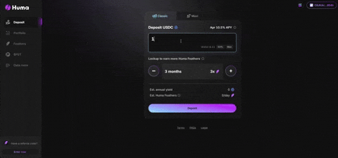

# Deposit
Depositing into Huma is easy and takes just a few steps. Choose your preferred **deposit mode** (Classic or Maxi), enter the amount you'd like to deposit, select a **lockup period** (or go with no lockup), and sign the transaction with your wallet. You'll instantly see your **estimated stable yield** and your **daily Huma Feather rewards** based on your selection.

Once your deposit is confirmed, head to the **Portfolio** page to view your active positions and track when each **lockup period ends**.

