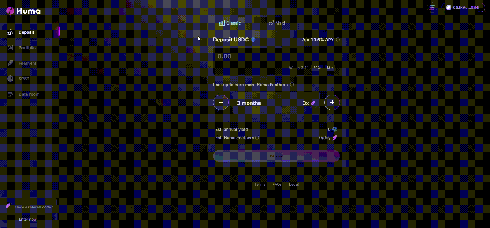

# Portfolio
The Portfolio page serves as your central hub for managing your pool positions. Here, you can view your balance, track the total Feathers you've earned, review active positions, and check your transaction history. You can also take actions such as switching modes, extending lockup periods, or requesting withdrawals.

