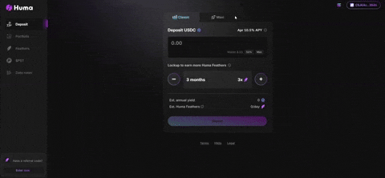

# Switching Modes
Flexibility is built in—you can switch between modes while keeping your lockup periods intact. For example, if you deposit $100 in Maxi Mode and receive 100 mPST tokens with a 6-month lockup, and then decide to switch to Classic Mode after 3 months and 23 hours, the following will occur:

- Your 100 mPST tokens will be burned.
- Given a PST price of 1.025 at that moment, you'll receive 97.5 PST tokens.
- For that month, both your stable yield and Feathers rewards will be calculated using the Maxi rate for the first 23 hours and the Classic rate for the remainder of the month.

This flexible structure allows you to tailor your investment strategy as your needs evolve.

