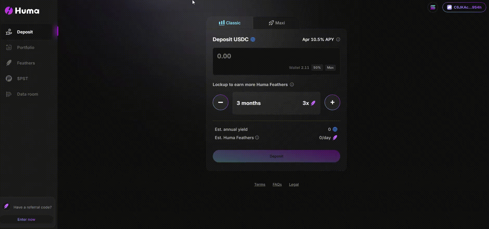

# Withdrawal
If your funds aren't locked up, you can redeem them anytime. However, if your funds are committed to a lockup, you can only redeem them once the lockup period ends.

**Request Processing**
Redemption requests are handled on a first-come, first-served basis. We aim to process most redemptions within 1 business day, although our service level agreement (SLA) is 7 days.

**Request Submission Gating**
Please note that we stop accepting redemption requests once daily submissions (from 00:00 to 00:00 UTC on the next day) reach a configurable limit of shares.

**Fund Disbursement**
Once your redemption request is processed, the smart contract will automatically transfer your funds directly to the wallet you used for your deposit. In the rare event that the transfer fails, your funds will remain safely in the pool, and you can manually claim them from the Portfolio page.

