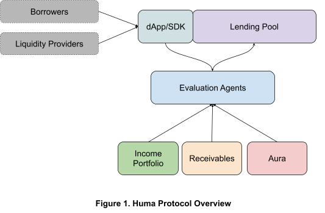

# Huma Protocol Spec v1

## Table of Content

- [1.0 Introduction](#10-introduction)
- [2.0 Income Portfolio Platform](#20-income-portfolio-platform)
- [3.0 Evaluation Agent (EA)](#30-evaluation-agent-ea)
- [4.0 Lending Protocol](#40-lending-protocol)
  - [4.1 Design Principles](#41-design-principles)
  - [4.2 User Roles](#42-user-roles)
  - [4.3 Protocol Administration](#43-protocol-administration)
  - [4.4 Pool Administration](#44-pool-administration)
  - [4.5 LP Participations](#45-lp-participations)
  - [4.6 Borrowing](#46-borrowing)
  - [4.7 Risk Management](#47-risk-management)
  - [4.8 Income and Loss Distribution](#48-income-and-loss-distribution)
  - [4.9 Upgradability](#49-upgradability)
- [5.0 Aura (Decentralized Credit Tracking)](#50-aura-decentralized-credit-tracking)
- [6.0 Governance](#60-governance)
- [6.1 Governance Council](#61-governance-council)

## 1.0 Introduction

**Huma is an open protocol for building next-gen decentralized lending solutions backed by income and receivables.**

Smart contracts’ transparency and automatic execution played a critical role in DeFi’s success and will continue to do so. At the same time, it lacked the most critical input that all modern risk underwriting depends on, income (cashflow). Moreover, DeFi had to rely solely on over-collateralization of a few digital assets, making adoption by new entrants really difficult. These substantially limited its reach and impact. As such limitations become more and more obvious to many in the industry, under-collateralization and lending for real world use cases naturally emerges as the next frontier.

**Our Belief**

In the next decade, tens of thousands of institutions and billions of people will onboard onto Web3 ecosystems. They won’t have rich crypto asset portfolios initially to collateralize against, however, most of them are going to be creditworthy participants.

The DeFi infrastructure for serving them is mostly missing today, and Huma Protocol is introducing such critical infrastructure elements to enable it.

We believe the future of DeFi is powered by automated underwriting as well as signals about the borrowers’ **Ability, Willingness, and Commitment** to pay.

- **Automated risk underwriting** (ARU): Most successful fintech players serve high volume of credit applications in an automated fashion, utilizing alternative data sources. All the major DeFi protocols are built on AMMs. However, it is a lot more complicated to support ARU in a risk-on world than a risk-off world. The ARUs are intelligent models. By nature, AI will find its role in the ARUs. At the same time, these ARUs will not be possible without additional data (e.g. income, credit worthiness).
- **Income**: Income is probably the most vital signal in most underwriting scenarios since it offers the best measure against **one’s ability to pay**. The more comprehensive we can understand income, the better we can underwrite.
- **Credit worthiness**: Credit worthiness is the most valuable signal for **one’s willingness to pay**. Web2’s credit score plays an important role, however it’s biased, limited, and controlled by a few agencies. We need decentralized credit systems.
- **Receivables**: Today, **collateral** in DeFi mainly represents a handful of digital assets backing debt. Majority of participants do not have tons of such digital assets idling, but most have **receivables** in the form of future invoices, transactions, subscription income, paychecks, royalties etc. In fact, in structured finance, such receivables are regularly used in securitization of loans. Receivables are the best signal for **one’s commitment to pay**, because once an entity transfers the ownership of their receivables to the lending platform, it acts as a payment guarantee. We actually think collaterals are just special forms of receivables. The only difference is that their cash value is available right now instead of at a future date.

### 1.1 Protocol Overview

Figure 1 shows a high-level overview of Huma Protocol:

- Income Portfolio - It is a comprehensive view of users’ Web3 and Web2 income. Income Portfolio Adapters (IPA) can be developed to capture income from Web3 income sources such as on-chain payments, staking, mining, NFT royalty, Web3 payroll, and Web2 sources. The Income Portfolio Platform is built in such a way that any developers in the community can contribute and share the upside of the IPAs. Please refer to &lt;<IPA Developer Guide>> for more information.
- Receivable Management - We have developed infrastructures to allow receivables to be captured in the form of NFTs, transferred, and used to secure credit borrowing.
- Evaluation Agent - This is an open platform for developers to contribute various risk underwriting models. Please refer to &lt;<Evaluation Agent Developer Guide>> for more information.
- Aura - This is the layer for capturing, reporting, and leveraging credit trustworthiness. Auro is not in scope for our v1 protocol. In v2, we will either compose a decentralized credit system or work with a consortium of innovators to define the new credit standard for Web3.
- Lending Protocol - This is a generic lending pool. It is designed to suit a broad range of use cases from receivable refactoring to general credit line. Please refer to &lt;<Huma Lending Protocol Technical Design>> for how to expand the protocol to launch more lending products.

## 2.0 Income Portfolio Platform

Income Portfolio Platform (IPP) provides a comprehensive view of users’ on-chain and off-chain income. It is an open framework for the community to easily contribute to Huma’s vision. Developers can participate in the effort by building Income Portfolio Adapters (IPAs) for various income sources. Each IPA shall understand the amount, frequency, and other objective quantities that describe the income associated with a wallet. This can include information about predicted future income from that source. The API interface of an IPA is covered in the technical design doc.

Example sources include;

- On-chain sources
  - Direct payments from treasuries, i.e. Gnosis SAFE’s, Circle Business Account
  - Payments/invoices like Request Network, Utopia Labs, Coinshift, Superfluid
  - Yield farming income
  - Staking, miner and validator income
  - Gaming income
  - …
- Off-chain
  - Transactions and SaaS revenue like Plaid, Teller, Stripe, Quickbooks, Recurly
  - Invoices like Stripe, PayPal, Invoice2Go, Square, Zoho
  - Income data aggregates like Pinwheel, Finicity, Argyle
  - Sales data like Shopify, Amazon,
  - Credit/debt data aggregates like Experian API
  - …

### 2.1 Life Cycle of an IPA

1. Developers build the IPA, conforming to IPP API and documentation guidelines, and submit it to Huma DAO for review and approval
2. Once accepted by Huma DAO, the Adapter will be deployed on IPP.
3. All the accepted IPAs will be listed under the same directory, for the Evaluation Agents(EAs)to consume.
4. Some performance stats about each IPA and share as metadata. This will be valuable to the EA developers. It will also serve as an input when Huma DAO decides how to distribute IP rewards to different IPA providers.
5. Each IPA shall be maintained by the original developer, Huma DAO, or the community.

### 2.2 Developer Participation and Rewards

Developers can contribute to the initial development and ongoing maintenance of the IPAs.

To bootstrap the development of IPAs, Huma will offer bounty programs via gitcoin platform or hackathons. The IPA submissions will be reviewed, and once approved, the developers will be rewarded with the bounties.

A portion of the protocol revenue will be carved out to reward IPA developers and maintainers. Huma DAO will review the contributions and determine how to split the total IPA rewards to different IPA contributors.

## 3.0 Evaluation Agent (EA)

Evaluation Agent developers build and plug in their context-aware risk management modules into Huma Protocol. Each EA implements a standard interface to interact with Huma SDK and Huma contracts.

All the EAs are expected to run off-chain considering the computational complexity involved. We do not expect EAs to be open-sourced in the foreseeable future as an anti-fraud measure.

### 3.1 EA Listing and Hosting

Each pool will select an EA to delegate its underwriting. EAs are expected to be highly specialized per use case initially, however it's also possible that more generic EAs are developed in the future.

The EA developers will submit EAs to Huma DAO for review. Once approved, the EAs will be deployed to a cloud platform provided by Huma. The cloud platform will be open-sourced, even though Huma does not require the EAs to open source their models.

In v2, we will look into making this platform more decentralized.

### 3.2 EA rewards and responsibilities

EAs are required to provide meaningful contributions to the liquidity pool so that they have enough skin in the game. The percentage of EA’s contribution is governed by a configuration parameter: \_liquidityRateInBpsByEA, which is determined by each Pool Owner.

EA takes a percentage of the pool income. It is defined in the configuration parameter \_rewardRateInBpsForEA. It can be configured for each pool balancing the liquidity contribution requirement.

## 4.0 Lending Protocol

On top of the Income Portfolio Platform and Evaluation Agent, Huma Lending Protocol intends to provide a credit line for every wallet. Different pools can be built to leverage different income streams and for various use cases, from credit card, receivable factoring, car loan, to many other forms of lending products. The protocol shall be designed in such a way that developers and business owners outside the Huma core team can develop and launch new products on the protocol.

### 4.1 Design Principles

#### 4.1.1 Transparency & Community Confidence

Transparency is critical to building community confidence. We will operate Huma Protocol at the highest level of transparency that we can.

Since the Protocol Owner wallet has a lot of power, it will be a multi-sig wallet with signees geographically distributed.

In addition, Timelock will be used so that the community has time to react to the proposed changes to the protocol. Openzeppelin timelock can apply different delays for different actions.

#### 4.1.2 Extensibility

Huma Protocol shall be designed as a full-stack protocol, instead of just a lending product. It shall allow developers and businesses to support new use cases by leveraging its Income Portfolio and EA Platforms. As a result, it should allow different pools to apply different underwriting policies and fee schedules. For example, it shall be able to support interest-only, minimal monthly payment (e.g. credit card), or installments (e.g. car loan, mortgage).

### 4.2 User Roles

There are various user roles in the protocol. Some are at protocol-level. The others are at pool-level. Let us start by studying the list of user roles and their responsibilities.

#### 4.2.1 Protocol-level Admin Roles

**Protocol Owner:** Protocol Owner is responsible for the administration of the entire protocol. It will be a multisig. After the initial deployment, the ownership will be transferred from the deployer to this multisig protocol owner. It has the following access rights:

- The only user who can change various [protocol configurations](#43-protocol-administration)

- The only user who can add and remove Pool Owners.
- The only user who can add and remove Pausers.
- One of the users who can pause the entire protocol.
- The only user who can unpause the protocol after it is paused by one of the pausers.
- The only user other than the pool owner who can perform admin tasks on a pool.
- The only user who can transfer protocol income from pool wallet to protocol treasury.

**Pausers:** Pausers can call a pause function to pause the entire protocol. When the protocol is paused, no money moves in or out of the protocol. This is expected to happen in very rare cases, such as major security attacks, or serious security issues discovered. It is expected for the protocol to have multiple pausers, possibly including an external security monitoring firm. The only thing that a pauser can do is to pause the protocol, nothing else. After the protocol is paused, only the Protocol Owner can unpause it.

**Protocol Treasury:** This is technically not a user. It is the wallet to hold treasury for the protocol.

#### 4.2.2 Pool-level User Roles

**Pool Owners**: Pool owners are a list of addresses that are approved by the ProtocolProtocol Owner to create and manage pools. They have the following access rights:

- The only user who can set Evaluation Agent for the pool.
- The only user who can set Fee Manager to be used by the pool and configure the Fee Manager.
- The only user who can change various[pool configurations](#442-pool-configurations).

- The only user who can transfer the Pool Owner’s income from the pool.

**Evaluation Agent:** The Evaluation Agent makes underwriting decisions for a pool. Each pool can only have one Evaluation Agent. They have the following access rights:

- The only user who can approve credit requests to the pool.
- The only user who can post a pre-approved credit line to the pool contract.
- The only user who can post off-contract payments received and trigger subsequent actions by the contract.
- The only user who can transfer the EA’s income from the pool.

After the pool owner has set the evaluation agent for the pool, the EA has to deposit the required capital before the pool owner to enable the pool.

Pool owner can choose to change the evaluate agent for the pool. When this happens, all the accrued EA rewards are paid to the old EA immediately. The EA needs to have made the required deposits.

**Liquidity Providers:** Liquidity Providers (a.k.a. Lenders) provide capital to the pool and expect financial returns for their investment. The only actions that they can do are depositing and withdrawing capital from the pool.

**Borrowers:** Borrowers are the party who initiates a credit line with the pool and drawdown against the credit line. They are responsible for paying interest and minimal principal payment per pay period.

### 4.3 Protocol Administration

**Pause Protocol:** At critical time, any of the pausers can pause the protocol. After a protocol is paused, it does not accept any actions that involve money flow in or out, i.e., no deposits, no withdrawals, no drawdowns, no repayments.

**Unpause Protocol:** Resume the protocol operations. Only the Protocol Owner can unpause the protocol.

**Add / Remove liquidity assets allowed:** This is the list of assets to be allowed as the underlying assets for pools in the protocol. We will only support stablecoins in the foreseeable future, starting with USDC.

**Change Protocol-level Grace Period for Defaults:** Protocol offers the default value for the grace period for defaults. Each pool can overwrite this default value.

**Change Protocol Treasury:** This is the wallet address for the protocol treasury. Only pool owner can change this address.

**Change Protocol Fee:** Since Huma is a risk-on protocol, it is fair for the protocol to take a share of all the fees and interest generated in the protocol. To keep it simple, the protocol fee will simply be a percentage of all the fees and interest generated in the protocol. Initially, this Protocol Fee percentage will be configured by the protocol owner, later on, Huma DAO will take over the responsibility.

**Add or remove pool owners:** Add or remove a pool owner.

**Add or remove pausers:** Add or remove a pauser.

### 4.4 Pool Administration

Under Huma protocol, many pools can be created for specific business opportunities. They will attract different sets of lenders and borrowers to serve different purposes.

#### 4.4.1 Pool Initialization

When a pool is initialized, the following information shall we specified:

- Pool name: the name of the pool
- Pool token (HDT) : the utility token used to track LP’s contribution to the pool. Please see section [link](#454-Pool-Liquidity-Ownership) for more detail.

- Huma Config: Huma Config hosts all the global configurations.
- Fee Manager: A FeeManager implements all the core functions around fee calculation. Every pool can have its own FeeManager implementation.

Both Pool Owner and Evaluation Agent commit to provide a certain percentage of the pool liquidity. Once the pool is initiated, and after the Pool Owner and Evaluation Agent deposit the required liquidity, the pool can be enabled by the Pool Owner to accept additional deposits from the lenders. At that point, the pool will open to the borrowers.

#### 4.4.2 Pool Configurations

**Pool Name:** Each pool needs to have a name. This name will be listed on the Huma website. We will define an off-chain workflow to make sure of the uniqueness of the pool names.

**Underlying Token:** This is the asset to be used for lending and borrowing in the pool. In v1, we will support USDC only.

**Liquidity Cap:** the cap of liquidity for the pool in the unit of underlying token. Pool owners can set and change it.

**Pool Owner Commitment Rate:** the portion of the pool liquidity to be deposited by the pool owner. It will be represented in basis points.

**Evaluation Agent Commitment Rate:** the portion of the pool liquidity to be deposited by the Evaluation Agent. It will be represented in basis points.

**Max Credit Line:** The max credit line allowed by the pool. If the credit limit approved by EA is above this line, the request will be rejected.

**Pool APR:** Interest rate for the pool. It is represented in basis points.

**Origination Fee:** a fee to be charged when the user completes a drawdown. It can be a fixed fee or a percentage of the drawdown amount or a combination of both. In reality, we expect most pools to use a percentage. The percentage will be represented in basis points. What the borrower gets is the net of the drawdown amount and this fee.

**Late Payment Fee:** a fee to be charged when the borrower is late for a payment or the payment is lower than the required due amount. The late fee can be a fixed fee or a percentage of the total outstanding balance or a combination of both. Please note when a percentage is used to calculate the late fee, the percentage is applied to the entire balance instead of the amount due. For example, if the outstanding balance is $5000 and the amount due for this cycle is $500, if the late fee rate is 1% per period, the late fee will be $50 instead of $5. If the user is late for several periods in a row. the late fee will be charged each period.

**Membership Fee:** a fixed fee per pay period.

**Required receivable rate:** The ratio between the value of the receivables and the credit limit. The ratio will be represented in basis points. There must be enough receivables deposited or making the pool the beneficiary of the receivable before the borrowers can draw down using the approved credit line.

**withdrawalLockoutPeriod:** this is the period that the lender is prevented from withdrawing since its last deposit to the pool. This will be represented in seconds. The protocol will ensure it is longer than 30 days to guard pool admin from careless mistakes.

**poolDefaultGracePeriod:** the grace period between the due date and the moment that a default can be triggered. Late fees will apply during the default grace period.

**Pay Period Duration:** The duration for each pay period. This can be configured in days. Every borrower follows the pay period duration to calculate its next due.

**minPrincipalRateInBps:** Min percentage of the principal due at each pay period. This will be represented in basis points.

#### 4.4.3 Pool Administration

**Enable and Disable Pool:** Pools can be enabled when the essential configurations are setup and the required minimal liquidity has been deposited by the admins.

**Set Evaluation Agent:** Set the evaluation agent

Set and update the configurations outlined in[the section above](#442-pool-configurations).

### 4.5 LP Participations

#### 4.5.1 Qualification

LP needs to pass KYC/KYB/AML to participate in the pool. The process will be managed off-chain in v1 through partner services like Credora or Parallel Markets. As a result, the pool owner will add LP to the pool. Only after that, the LP can deposit and withdraw.

#### 4.5.2 Deposits

LP can contribute capitals to the pool as long as it has not reached the liquidity cap set by the pool owner. There is no max or min requirement for each deposit. After each deposit, the withdrawalLockupPeriod is reset, i.e., the LP has to wait for the period defined by withdrawalLockupPeriod before withdrawal.

#### 4.5.3 Withdrawal

Once the withdrawalLockupPeriod is passed, the LP can choose to withdraw from the pool. The LP can choose to withdraw a portion or the entire withdrawable amount.

In v2, we are planning to introduce an opportunity cost pricing as a form of exit fee to make pools more sustainable and fair to all lenders.

#### 4.5.4 Pool Liquidity Ownership

Huma Distribution Token (HDT) is a utility token used to track LP’s contribution to the pool. The current value of HDT reflects the performance of the pool so far. Each pool creates a new instance of HDT. They are minted when LPs contribute capital to the pool, and burned during withdrawal.

### 4.6 Borrowing

**Borrowers access capital from specific pools that match their needs.**

Institutional or retail borrowers are able to borrow from lending pools, as long as they have active income portfolios and/or receivables supported by the lending pool.

Each borrower goes through an automated evaluation process by the designated Evaluation Agent of the pool. The evaluation agent determines whether the borrower can borrow and at which terms.

Optionally, EAs can also confirm KYC/KYB/AML requirements for borrowers if required by PoolOwners.

#### 4.6.1 Credit Line

What Huma offers to the borrowers are credit lines. Based on the information that the Evaluation Agent can gather about the account, it approves a credit line with a credit limit. After the approval, the borrower can drawdown or payback at any time that they want as long as the total outstanding balance is below the credit limit.

EA can update the terms of the credit line for various reasons. Some sample reasons are massive changes to the external environment, or changes to the borrower’s financial situation, or algorithm enhancements.

In Web3, it is preferred for the users to initiate any actions rather than the protocol. We want to give EA the power to change the terms of the credit line before a new drawdown, at the same time, it suits Web3 pattern better if this process is triggered by the users. Instead of having EAs periodically update the terms of the credit lines, we can allow the users to get the latest terms of their credit line before requesting a new drawdown. This will prompt the EA to run its algorithm and update the contract with the latest terms.

#### 4.6.2 Interest Rate

Each credit line has its personalized interest rate. The Evaluation Agent will consider each account’s credit history and income stability to determine the interest rate.

This rate can be changed by the Evaluation Agent. Since it is a credit line, the new interest rate will apply to both the existing balance and new drawdowns. The rate change will take effect starting from the next pay period, thus, there is no change to the due amount to the current pay period.

#### 4.6.3 Payments Per Cycle

The amount due for each pay period is calculated using the following formula:

Amount Due = Late Fee + Interest Fee + Principal Due

Late fee will be charged if the full amount due from the last pay period is not paid in full by the end of the pay period. First, the remaining amount due is added to the outstanding balance. Then the following formula is used to calculate the late fee.

Late Fee = Flat Rate + Percentage Rate \* Total Outstanding Balance.

Interest Fee is computed using the following formula. The corrections are introduced to reflect additional drawdown or principal payment during the middle of the pay period. For example, if there is a drawdown in the middle of the cycle, the Total Outstanding Balance at the end of the pay period is higher than the actual balance in part of the pay cycle, thus the interest fee will be overly charged, thus a negative correction shall be applied. Similarly, when there is a payment towards principal, the Total Outstanding Balance at the end of the cycle gets lower, the interest fee is thus under accounted for, thus a positive correction amount.

Interest Fee = Total Outstanding Balance _ APR _ Seconds in a Pay Period / Seconds in a year + Corrections

Principal Due is the product of Total Outstanding Balance and the min principal payment rate.

Please note in solidity, all divisions round to zero. We will round Late Fee, Interest Fee, and Principal Due separately. For example, if Late Fee is 3.3, Interest Fee is 2.9, Principle Due is 4.9, the Amount Due is 9, instead of 11.

### 4.7 Risk Management

#### 4.7.1 Underwriting Decision

EA takes the borrowers’ income portfolio, credit history, and other factors to decide if to approve a credit line, the credit limit to be approved and the interest rate for the credit line.

While we believe the majority of decisions are going to be fully automated, for sophisticated lending cases, EAs can be configured to work in hybrid mode, requiring human supervision to do the final approval.

In v2, the performance of each EA, including approval rate and risk loss rate, will be available for the Pool Owner to review.

#### 4.7.2 Default flow

Each pool can define a default grace period, which is a multiple of the pay periods. Once the grace period has passed, if the borrower still has not paid the amount due yet, the default process will be triggered. The entire balance including principal, interest, and fees, including the fees and interest accrued during the grace period, will be written off as losses. The losses will be distributed to the LPs per their shares of the liquidity pool.

To be explicit, the protocol, pool owner, and EA themselves do not share the losses, however, since Pool Owner and EA have contributed as a LP, they will share the losses in the same way as any other LPs.

Once the default is triggered, the balance is written off and the accounting should follow accordingly.

At the same time, the borrowing record will still be open and the borrower still has a chance to make payment towards the balance due. This is unlikely to happen, all the payments will be considered as income to the pool and follow the income distribution process.

### 4.8 Income and Loss Distribution

The protocol defines a percentage of all pool income that goes to the protocol treasury. Huma DAO will then decide how to distribute the income. We know a portion of it will go to the IPA

developers.

For any pool income, it will allocate the portion for the protocol first, and distribute the remainder to the pool. For the portion allocated to the pool, it will first distribute the commission to the EA. The remainder will be distributed to all the LPs per their share of ownership of the liquidity pool.

For the amount allocated for the protocol, to avoid unnecessary gas waste, it will not be moved to the protocol treasury immediately. it will be kept in the pool wallet but with a clear record. The protocol owner can trigger the withdrawal any time and resulting in an immediate transfer.

The same process applies to the commission fee for the EAs. It will be kept in the pool wallet with a clear record and the EA can trigger a transfer at its sole discretion.

### 4.9 Upgradability

We expect the core contracts to continue to evolve, thus upgradability is critical for the pool contracts and Huma Distribution Token contract.

## 5.0 Aura (Decentralized Credit Tracking)

Aura is the layer capturing, reporting, and leveraging credit trustworthiness. This is not in scope for our v1 protocol, as decentralized solutions in this space are also in early development. In v2, we will either compose with a mature solution out of those or work with a consortium of innovators to define the new credit standard for Web3.

## 6.0 Governance

Huma’s governance is going to be managed by its community DAO which will maintain and update the protocol via decentralized voting. DAO will be responsible for tasks like :

- Managing DAO treasury
- Growing the community of IPA and EA builders
- Securing and maintaining the IPA and EA platforms
- Upgrading contracts
- Responding to emergencies by pausing and unpausing the protocol
- Launching new community pools and acting as PoolOwner where needed
- Updating protocol configurations
- Planning tokenomics for HUMA tokens, as well as rewards and distributions

## 6.1 Governance Council

The Governance Council will represent all major stakeholders of the platform and will be in charge of executing the decisions made by Snapshot votes through a multi-sig.

### 6.2 Participation

Anybody will be able to participate in governance through proposals, discussions, and Snapshot votes.
