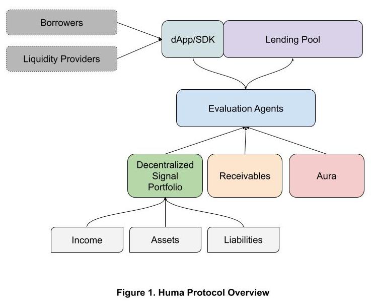

# Huma Protocol Whitepaper 1.0

### Table of Contents

* 1.0 Introduction
* 2.0 Decentralized Signal Portfolio (DSP)
* 3.0 Evaluation Agent (EA)
* 4.0 Lending Protocol
  * 4.1 Design Principles
  * 4.2 User Roles
  * 4.3 Protocol Administration
  * 4.4 Pool Administration
  * 4.5 LP Participations
  * 4.6 Borrowing
  * 4.7 Risk Management
  * 4.8 Income and Loss Distribution
  * 4.9 Upgradability
* 5.0 Aura (Decentralized Credit Tracking)
* 6.0 Governance
* 6.1 Governance Council

### 1.0 Introduction

**Huma is an open protocol for building next-gen decentralized risk and lending solutions backed by income and receivables.**

Smart contracts’ transparency and automated execution played a critical role in DeFi’s success and will continue to do so. At the same time, the current DeFi ecosystem falls short when it comes to lending for real world use cases, where real users and yields are. First of all, it lacks the most critical input that all modern risk underwriting depends on, income (cashflow). Moreover, it relies solely on over-collateralization of a few digital assets, making adoption by new entrants really difficult. As such limitations become obvious to many in the industry, under-collateralized lending for real world use cases emerges as the next frontier.

**Our Belief**

In the next decade, tens of thousands of institutions and billions of people will onboard onto Web3 ecosystems. They won’t have rich crypto asset portfolios initially to collateralize against, however, most of them will be creditworthy participants.

The DeFi infrastructure for serving them is mostly missing today, and Huma Protocol is introducing such critical infrastructure elements to enable it.

We believe the future of DeFi is powered by automated underwriting supported by signals about the borrowers’ **Ability, Willingness, and Commitment** to pay.

* **Automated risk underwriting** (ARU): Most successful fintech players serve high volume of credit applications in an automated fashion, often utilizing a variety of data sources. Similarly, major DeFi protocols are all run by Automated Market Makers(AMMs). However, it is a lot more complicated to support ARU in a risk-on world than in a risk-off world. Naturally, ARUs will evolve as additional data points (e.g. income, credit worthiness) and better intelligent models are introduced.
* **Income**: Income (cashflow) is the most vital signal in a wide array of underwriting scenarios, since it offers the best measure for **ability to pay**. The more comprehensive we can understand income, the better we can underwrite.
* **Receivables**: Today, **collateral** in DeFi mainly represents a handful of digital assets. The majority of businesses and people in the world do not have tons of digital assets idling, but they do have **receivables** in the form of future invoices, transactions, subscription revenue, paychecks, royalties etc. In fact, in structured finance, such receivables are regularly used in the securitization of loans. Receivables are the best signal for **commitment to pay**, because once an entity transfers the ownership of their receivables to the lending platform, it acts as a payment guarantee. We actually think collaterals are just special forms of receivables.
* **Credit worthiness**: Credit worthiness is the most valuable signal for **willingness to pay**. Traditional credit scores played an important role for a long time, however they are known to be biased, and heavily centralized. We need alternative decentralized systems to carry these signals and to establish borrowing accountability.

**1.1 Protocol Overview**

<figure><figcaption></figcaption></figure>

Huma intends to level up DeFi infrastructure so that more signals can be captured and used to underwrite risk-on borrowings to massively expand the reach of DeFi. Figure 1 shows a high-level overview of the Protocol:

* **Decentralized Signal Portfolio** - This is an open platform that facilitates access to high quality signals about a borrower's income, assets and liabilities. These signals can be gathered from a variety of on-chain or off-chain sources. Any developer can add a new Signal Adapter for a particular signal source to enhance underwriting. Please refer to DSP Developer Guide for more information.
* **Receivables** - It is the infrastructure that manages receivables captured in the form of NFTs, which can be transferred, and used to secure debt.
* **Evaluation Agent** - This is an open platform for developers to contribute various risk underwriting models. Please refer to Evaluation Agent Developer Guide for more information.
* **Aura** - This is the layer for capturing, reporting, and leveraging credit trustworthiness. Aura is not in scope for our v1 protocol. In v2, Huma will integrate with decentralized reputation systems that combine on-chain and off-chain data points.
* **Lending Protocol** - This is a generic lending pool. It is designed to suit a broad range of use cases from receivable refactoring to general purpose credit lines. Please refer to Huma Lending Protocol Technical Design for how to expand the protocol to launch more lending products.

### 2.0 Decentralized Signal Portfolio (DSP)

High quality automated underwriting requires high quality signals. Decentralized Signal Portfolio (DSP) provides a comprehensive view of borrowers’ **income, assets and liabilities**, gathered from sources both on-chain and off-chain.

DSP supports authenticated signals where the borrower can voluntarily authenticate financial accounts to share specific information. These signals can be associated with on-chain or off-chain identity. DSP has a built in encrypted IPFS based storage to keep a snapshot of signals used in underwriting. This design gives the borrower the rights to their own data.

Income related signals help understand the amount, frequency, and other objective quantities that describe the income associated with a wallet. This can include information about predicted future income from that source as well.

Asset related signals help understand the quality and quantity of the assets the borrower is holding.

Liabilities are signals about a borrower’s payment obligations from their assets and future income.

DSP defines a unified interface for the community to easily contribute to Huma’s vision. Developers can participate in the effort by developing Signal Adapters for specific signals that can improve underwriting decisions. Signal Adapters are open-sourced for full transparency. Please refer to the DSP Developer Guide on how to contribute.

There are a wide range of sources that a Signal Adapter can be developed. Examples include;

* On-chain sources
  * Direct payments from treasuries, i.e. Gnosis SAFE’s, Circle Business Account
  * Payments/invoices like Request Network, Utopia Labs, Coinshift, Superfluid
  * Positions in lending pools
  * Yield farming
  * Staking, miner and validator income
  * Gaming income
  * NFT royalties
  * …
* Off-chain
  * Balances, transactions and revenue like Plaid, Teller, Stripe, Quickbooks, Recurly
  * Invoices like Bill, Stripe, PayPal, Invoice2Go, Square, Zoho
  * Income data aggregates like Pinwheel, Finicity, Argyle
  * Sales data like Shopify, Amazon
  * Credit/debt data aggregates like Experian API
  * …

#### 2.1 Life Cycle of a Signal Adapter

1. Developers implement the Signal Adapter, conforming to interface and documentation guidelines, then submit it to Huma DAO for review
2. Once accepted by Huma DAO, the Signal Adapter will be deployed on DSP with the appropriate open source license.
3. All the accepted Signal Adapters will be listed to be consumed by the Evaluation Agents (EAs).
4. Performance stats about Signal Adapters will be gathered regularly and shared as metadata. This will be valuable to the EA developers. It will also serve as an input to rewards are distributed to different contributors.
5. Each Signal Adapter shall be maintained by the original developer, Huma DAO, or the community.

#### 2.2 Developer Participation and Rewards

Developers can contribute to the initial development and ongoing maintenance of the Signal Adapters.

To bootstrap the development, Huma will offer bounty programs.

A portion of the protocol revenue will be carved out to reward Signal Adapter developers and maintainers. Huma DAO will review the contributions and determine how to split the total reward pool to different contributors.

### 3.0 Evaluation Agent (EA)

Evaluation Agent (EA) is the risk management layer in the Huma Protocol. They are responsible for the underwriting decisions for the pools they are associated with. The goal for the EA platform is to build a secured, community-driven system to support accurate underwriting decisions at scale.

Each EA implements a standard interface to interact with Huma SDK and Huma contracts. They also have borrower authenticated read access to relevant signals in the DSP for their models.

<figure><figcaption></figcaption></figure>

#### 3.1 EA Listing and Hosting

EA developers submit their models, EAs, to Huma DAO for review. Once approved, the EAs are deployed in a secure container provided by Huma.

An NFT is minted to represent each EA. Although any developer can mint an EA NFT, only Huma DAO can update the relevant metadata (e.g. status, performance) for each EA NFT and creates an entry in the EA Registry so that it is discoverable by pool owners.

Each pool selects an EA from this registry to delegate its underwriting. EAs can further specialize to serve the use cases of a specific pool, or stay more generic to support more pools.

The EAs are fully decentralized. For anti-fraud consideration, Huma does not require the EAs to open source their models. Both Huma and the Pool Owner will inspect and validate the EA before selecting it to underwrite for a pool.

This hosting platform will be open-sourced. It is centralized at this moment due to the need for complicated computations. As decentralized execution engines become more powerful, we will transition the EA hosting platform to a decentralized execution platform as well.

#### 3.2 EA rewards and responsibilities

EAs are required to provide meaningful contributions to the liquidity pool so that they have enough skin in the game. The percentage of EA’s contribution is governed by a configuration parameter: `_liquidityRateInBpsByEA`, which is determined by each Pool Owner.

EA takes a percentage of the pool income. It is defined in the configuration parameter `_rewardRateInBpsForEA`. It can be configured for each pool balancing the liquidity contribution requirement.

### 4.0 Lending Protocol

On top of the Decentralized Signal Portfolio and Evaluation Agent, Huma Lending Protocol makes it possible to create a credit line for every wallet. Different pools can be built to leverage different income streams and for various use cases, from business loan, personal loan, factoring, to many other forms of lending products. The protocol is designed to let developers and busineses develop and launch new products easily on it.

#### 4.1 Design Principles

**4.1.1 Transparency & Community Confidence**

Transparency is critical to building community confidence. We will operate Huma Protocol at the highest level of transparency.

For wallets representing administrative roles, both at the protocol-level and for every pool, we will require multi-sig with a diverse group of signees. Timelock will be used so that the community has time to react to the proposed changes to the protocol. In addition, the timelock contract addresses and multi-signers addresses will be published in a blog for full transparency.

**4.1.2 Extensibility**

Huma Protocol is designed as a full-stack protocol, instead of just a lending product. It allows developers and businesses to support new use cases by leveraging its Income Portfolio and EA Platforms. As a result, different pools can apply different underwriting policies and fee schedules. For example, it is able to support interest-only and minimal monthly payments, and it can be easily extended to support installments.

#### 4.2 User Roles

There are various user roles in the protocol. Some are at protocol-level. The others are at pool-level. Let us start by studying the list of user roles and their responsibilities.

**4.2.1 Protocol-level Admin Roles**

**Protocol Owner:** Protocol Owner (a multi-sig) is responsible for the administration of the entire protocol. This is the only account that can change various protocol configurations and perform administrative tasks, most notably, adding and removing pool owners and pausers, unpausing the protocol, and transferring protocol income from pool wallet to protocol treasury.

**Pausers:** Pausers can pause the entire protocol. When the protocol is paused, no money moves in or out of the protocol. This is expected to happen in very rare cases, where the safety and integrity of the protocol is threatened. There can be multiple pausers, including external security monitoring firms. After the protocol is paused, only the Protocol Owner can unpause it.

**4.2.2 Pool-level User Roles**

**Pool Owners**: Pool owners are a list of addresses that are approved by the Protocol Owner to create and manage pools. They configure the key parameters for the pool, choose the Evaluation Agent and set the fee structure through Fee Manager. They earn a percentage of the pool income as a reward.

**Evaluation Agent:** The Evaluation Agent (EA) makes underwriting decisions, approve or disapprove credit requests for a pool. Each pool can only have one Evaluation Agent. We envision most of the EAs to be automated, but the protocol also allows EAs to have human supervision. They earn a percentage of the pool income for their contribution as a reward.

To drive accountability, similar to the Pool Owners, EAs are required to commit capital to the pools that they are supporting. Only after both the Pool Owner and EA have deposited the required capital, can a pool be enabled to accept capital from other Liquidity Providers. In rare occasions, Pool Owners are allowed to change the EA for the pool. The new EA needs to meet the deposit requirements before the change can happen. All the accrued EA rewards are paid to the old EA immediately after the change takes effect.

**Liquidity Providers:** Liquidity Providers (a.k.a. Lenders) provide capital to the pool and earn a proportional share of the pool income. They can only deposit and withdraw capital from the pool.

**Borrowers:** Borrowers initiate credit requests with the pools and drawdown against it if approved by the designated EA. They are responsible for paying interest and minimal principal payment per pay period.

#### 4.3 Protocol Administration

**Pause Protocol:** In an emergency, any of the pausers can pause the protocol. After a protocol is paused, it does not accept any actions that involve money flow in or out, i.e., no deposits, no withdrawals, no drawdowns, no repayments.

**Unpause Protocol:** Resume the protocol operations. Only the Protocol Owner can unpause the protocol.

**Add / Remove liquidity assets allowed:** This is the list of assets to be allowed as the underlying assets for pools in the protocol. We will only support stablecoins in the foreseeable future, starting with USDC.

**Change Protocol-level Grace Period for Defaults:** This is the protocol-level preset value for the grace period after which an overdue debt is considered a default. Individual pools can overwrite this protocol-level setting to suit the needs of their pools.

**Change Protocol Treasury:** This is the protocol treasury wallet address. Only protocol owner (a multisig) can make this change.

**Change Protocol Fee:** Since Huma is a risk-on protocol with many participants and reward structures, it takes a share of all the fees and interest generated in the protocol. To keep it simple, the protocol fee is a percentage of all the fees and interest generated in the protocol.

**Add or remove pool owners:** Add or remove a pool owner.

**Add or remove pausers:** Add or remove a pauser.

#### 4.4 Pool Administration

Under Huma protocol, many pools can be created for specific business opportunities. They will attract different sets of lenders and borrowers to serve different purposes.

**4.4.1 Pool Initialization**

Both Pool Owner and Evaluation Agent commit to provide a certain percentage of the pool liquidity. Once the pool is initiated, and after the Pool Owner and Evaluation Agent deposit the required liquidity, the pool can be enabled by the Pool Owner to accept additional deposits from the lenders. At that point, the pool will open to the borrowers.

**4.4.2 Pool Configurations**

A pool owner can set and change the following configurations for the pool.

* Pool Liquidity Cap
* Pool Owner Capital Commitment
* Evaluation Agent Capital Commitment
* Max Amount Per Credit Line
* Pool APR
* Origination Fee
* Late Payment Fee
* Membership Fee
* Required Receivable Rate
* Withdrawal Lockout Period
* Default Grace Period
* Pay Period Duration
* Principal Payment Requirement Per Period

**4.4.3 Approve / Reject exceptional transactions**

For the receivable factoring use case, all future payments made for that receivable will be received by its new owner, the pool. The pool then will subtract the outstanding balance and disperse the remainder to the borrower. When the receivable payment is far higher than the factored amount and a big dispersement is expected, for security consideration, the transaction will be flagged for the pool owner to review. The pool owner can approve or reject the transaction based on the review result.

#### 4.5 LP Participation

**4.5.1 Qualification**

When required by the pool, LPs go through a KYC/KYB/AML process to participate in the pool. The process will be managed off-chain in v1 through partner services. Once qualified, the pool owner will add LP to the pool's allowed lenders list.

**4.5.2 Deposits**

LPs can contribute capital to the pool as long as it has not reached the liquidity cap set by the pool owner. There is no max or min requirement for each deposit. After each deposit, the withdrawalLockupPeriod is reset, i.e., the LP has to wait for the period defined by withdrawalLockupPeriod before withdrawal.

**4.5.3 Withdrawal**

Once the withdrawalLockupPeriod is passed, the LP is free to withdraw a portion or their entire withdrawable amount from the pool.

In v2, we are planning to introduce an opportunity cost pricing as a form of exit fee to make pools more sustainable and fair to all lenders.

Since the Pool Owner and EA are required to commit capital to enable the pool, they cannot pull out the amount required by the pool until the pool is set to retire. Consequently, they have to wait until all other LPs have withdrawn their investment before they can withdraw their own capital that are required by the pool.

**4.5.4 Pool Liquidity Ownership**

Huma Distribution Token (HDT) is a utility token used to track LP’s contribution to the pool. The current value of HDT reflects the performance of the pool so far. Each pool creates a new instance of HDT. They are minted when LPs contribute capital to the pool, and burned during withdrawal.

#### 4.6 Borrowing

**Borrowers access capital from specific pools that match their needs.**

Institutional or retail borrowers can borrow from lending pools, as long as they have active income portfolios and/or receivables supported by the lending pool.

Each borrower goes through an automated evaluation process by the designated Evaluation Agent of the pool. The evaluation agent determines whether the borrower can borrow and at which terms.

Optionally, EAs can also confirm KYC/KYB/AML requirements for borrowers if required by Pool Owners.

**4.6.1 Credit Line**

Within the Huma Protocol, borrowers are always interacting with a credit line. Based on the information that the Evaluation Agent gathers about the account, it approves a credit line up to a credit limit. The borrower can drawdown or payback at any time that they want, as long as the total outstanding balance is below this limit.

EAs can update an existing credit line, in cases where there are substantial changes to the external environment, or to the borrower’s financial situation.

**4.6.2 Interest Rate**

Each credit line has its personalized interest rate. The Evaluation Agent will consider each account’s credit history and income stability to determine the interest rate.

In rare occasions, EAs can update this rate. Since it is a credit line, the new interest rate will apply to both the existing balance and new drawdowns. The rate change will take effect starting from the next pay period, thus, there is no change to the due amount to the current pay period.

**4.6.3 Payments Per Cycle**

The amount due for each pay period is calculated using the following formula:

`Amount Due` = `Late Fee` + `Interest Fee` + `Principal Due`

Late fee will be charged if the full amount due from the last pay period is not paid in full by the end of the pay period. First, the remaining amount due is added to the outstanding balance. Then the following formula is used to calculate the late fee.

`Late Fee` = `Flat Rate` + `Percentage Rate` \* `Total Outstanding Balance`

Interest Fee is computed using the following formula. The corrections are introduced to reflect additional drawdown or principal payment during the middle of the pay period. For example, if there is a drawdown in the middle of the cycle, the Total Outstanding Balance at the end of the pay period is higher than the actual balance in part of the pay cycle, thus the interest fee will be overly charged, thus a negative correction shall be applied. Similarly, when there is a payment towards principal, the Total Outstanding Balance at the end of the cycle gets lower, the interest fee is thus under accounted for, thus a positive correction amount.

`Interest Fee` = (`Total Outstanding Balance` \* `APR` \* `Seconds in a Pay Period` / `Seconds in a year`) + `Corrections`

Principal Due is the product of Total Outstanding Balance and the min principal payment rate.

#### 4.7 Risk Management

**4.7.1 Underwriting Decision**

EA takes the borrowers’ income portfolio, credit history, and other factors to decide whether to approve a credit line, the credit limit and the interest rate.

While we believe the majority of decisions are going to be fully automated, for sophisticated lending cases, EAs can be configured to work in hybrid mode, requiring human supervision to do the final approval.

In v2, the performance of each EA, including approval rate and risk loss rate, will be available for the Pool Owner to review.

**4.7.2 Default flow**

Each pool can define a default grace period, which is a multiple of the pay periods. Once the grace period has passed, if the borrower still has not paid the amount due yet, the default process will be triggered. The entire balance including principal, interest, and fees, including the fees and interest accrued during the grace period, will be written off as losses. The losses will be distributed to the LPs per their shares of the liquidity pool.

Once the default is triggered, the balance is written off and the accounting should follow accordingly.

At the same time, the borrowing record will still be open and the borrower still has a chance to make payment towards the balance due, even though this is unlikely to happen. All the payments will be applied to offset the write-off first before used to pay additional fees accrued. The borrowing record will be in default state and the borrower is not allowed to borrow again until all the principal and accrued fees are paid off.

#### 4.8 Income and Loss Distribution

The protocol defines a percentage of all pool income that goes to the protocol treasury. Huma DAO periodically decides how to distribute the income to various participants.

Pool income, is distributed to the pool participants after protocol income is deducted. Out of all pool participants, EAs commission is distributed first. The remainder is distributed to the LPs per their share of ownership of the pool.

For the amount allocated for the Pool Owner, the Pool Owner has flexibility to decide when to withdraw its balance.

The same process applies to the commission fee for the EAs. It is kept in the pool balance with a clear record and the EA can trigger a transfer at its sole discretion.

#### 4.9 Upgradability

We expect the core contracts to continue to evolve, thus upgradability is critical for the pool contracts and Huma Distribution Token contract.

### 5.0 Aura (Decentralized Credit Tracking)

This is the layer for capturing, reporting, and leveraging credit trustworthiness. Aura is not in scope for our v1 protocol, as decentralized solutions in this space are also in early development. In v2, Huma will integrate with decentralized reputation systems that combine on-chain and off-chain data points.

### 6.0 Governance

Huma’s governance is going to be managed by its community DAO which will maintain and update the protocol via decentralized voting. DAO will be responsible for tasks like :

* Managing DAO treasury
* Growing the community of Signal and EA builders
* Securing and maintaining the DSP and EA platforms
* Upgrading contracts
* Responding to emergencies by pausing and unpausing the protocol
* Launching new community pools and acting as PoolOwner where needed
* Updating protocol configurations
* Planning tokenomics for HUMA tokens, as well as rewards and distributions

### 6.1 Governance Council

The Governance Council will represent all major stakeholders of the platform and will be in charge of executing the decisions made by Snapshot votes through a multi-sig.

#### 6.2 Participation

Anybody will be able to participate in governance through proposals, discussions, and Snapshot votes.
