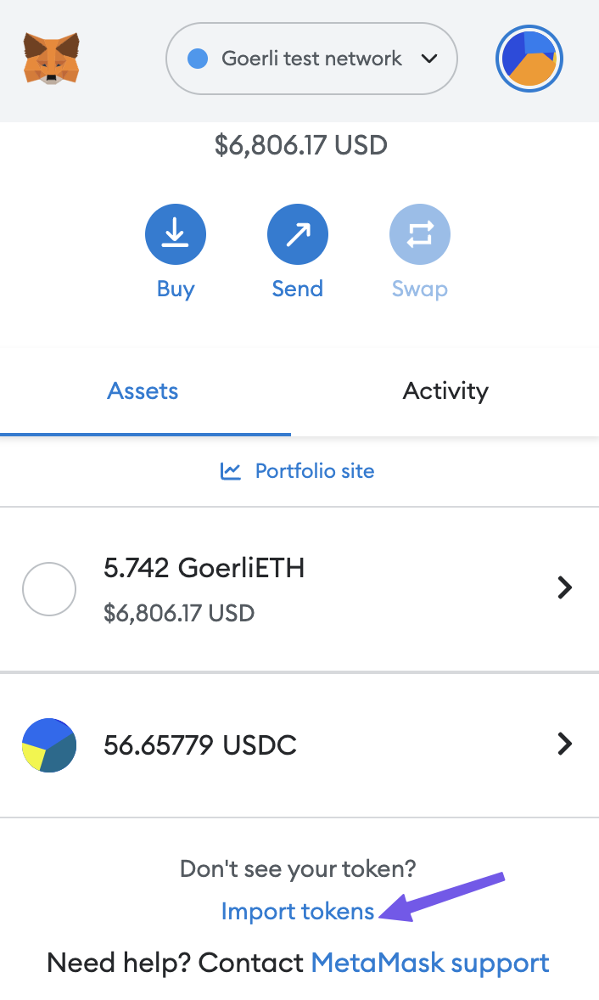

# Huma Private Beta Testing Guide

GM! Welcome to HUMAnity, the community for Huma Finance.&#x20;

After launching Huma Protocol on Polygon and Ethereum Mainnet, we are pleased to welcome you, our trusted friends, to our Private Beta testing program. This doc is a quick guide to help you understand Huma Protocol and how you can contribute to the Beta program.&#x20;

### Step 0: [Join Our Discord](https://discord.gg/uHwMKaGBYP)

Please use [this](https://discord.gg/uHwMKaGBYP) link to join our discord server. We will be there to talk about anything.

### Step 1: Please review key documents

[Huma Protocol Whitepaper 1.0](https://docs.huma.finance) gives an overview of Huma Protocol. It is a great place to start. It is critical to read the introduction section to get a high-level picture about Huma Protocol before you proceed further.&#x20;

For those who are interested in the technical implementations and opportunities to contribute to the platform, please refer to [Huma Protocol Technical Design](https://www.notion.so/Huma-Protocol-Technical-Design-3f14b57e6a2844248e93c37bc5322552) and [Huma Developer Guide](https://docs.huma.finance/developer-guidlines).&#x20;

### Step2: Test Huma DApp on Goerli

On Ethereum testnet Goerli, we have launched two pools: one credit line pool, one invoice factoring pool. Please access [https://app.huma.finance](http://app.huma.finance) and select Goerli network to try them out.&#x20;

* Make sure you are using a “Goerli Testnet Network” when you connect with the app. [Here](https://blog.cryptostars.is/goerli-g%C3%B6rli-testnet-network-to-metamask-and-receiving-test-ethereum-in-less-than-2-min-de13e6fe5677)’s a guide on how to enable it on MetaMask.
* Add our "mock USDC token" for testing to your wallet.  Click "import token" on MetaMask, fill in the contract address `0xf17FF940864351631b1be3ac03702dEA085ba51c.`(see appendix 1)
* Grab some [Goerli ETH](https://goerlifaucet.com/) to pay the gas fee when testing.&#x20;
* Send some "mock USDC tokens" to yourself for testing from [Etherscan](https://goerli.etherscan.io/address/0xf17FF940864351631b1be3ac03702dEA085ba51c#writeContract). (see appendix 2)
* If you need help getting test ETH or USDC, please post your test wallet address in the #beta-support channel, and we will transfer some tokens to you.

### Step 3: Be one of the first Huma users on Polygon and Mainnet

Huma is live on Polygon. You can access [https://app.huma.finance](http://app.huma.finance) and select Polygon as the network. At this moment, it is open to whitelisted users only. Once you have finished testing on Goerli, you will be notified with how to get whitelisted and become one of the first Huma users.

After you are done testing on Polygon, you can go further to score bonus points by testing on Ethereum Mainnet. You will be using the same app, just choose Mainnet using the network selector. &#x20;

### Step 4: Contribute to Huma Protocol

As an engineer, there are several ways that you can contribute to Huma Protocol:&#x20;

* Review our contracts, audit report and share your feedback. All the contracts have been open sourced and you can access in [Github](https://github.com/00labs/huma-contracts/tree/844f4c9cbe2361ce7a57f9da4939c740bf236b6d).&#x20;
* Become of one of the first batch of community developers to develop your own Signal Adapter and Evaluation Agent.&#x20;
* Identify potential secure weaknesses and submit through a security bug bounty program to be launched soon.&#x20;

Not only engineers can contribute to Huma Protocol, business leaders can play a key role as well.&#x20;

* Huma lending protocol is a generic protocol. We welcome business leaders to leverage the power of Huma Protocol and launch various pools. If If you have a business use case that is suitable for Huma Protocol, please drop us a note on Discord.&#x20;
* We are looking to partner with DAOs who make payments to their DAO members. If you are close to some DAOs who might benefit from Huma protocol, please make the connection for us.&#x20;
* We are looking for community builders to help us to build HUMAnity. Please let us know if this is  in your alley.

### Step5: Share Additional Feedback

We are open to feedback from all angles, from product, security, operations, and business development. Just hit us with anything, we will listen and enable your idea to help the broader HUMAnity.&#x20;

### Step 6: Look out for a Huma Beta Tester NFT&#x20;

Yes, it is real and on its way to your wallet, just waiting for you to complete a few actions listed above.&#x20;

### Appendix

1. Import new token to MetaMask. (0xf17FF940864351631b1be3ac03702dEA085ba51c)

2\. Use [Etherscan](https://goerli.etherscan.io/address/0xf17FF940864351631b1be3ac03702dEA085ba51c#writeContract) to send mock USDC to your wallet.&#x20;

.png>)
