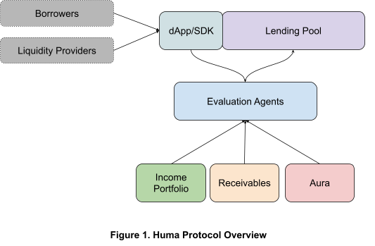

# Huma Protocol Technical Design

## Table of Content

- [Overview](#overview)
  - [Our Belief](#our-belief)
  - [Huma’s Technical Bets](#humas-technical-bets)
  - [Interaction between Components](#interaction-between-components)
- [Huma Lending Protocol](#huma-lending-protocol)
  - [Contract Architecture](#contract-architecture)
  - [Fee Calculation and Management](#fee-calculation-and-management)
    - [Extensible Fee Manager](#extensible-fee-manager)
    - [Bill Triggering](#bill-triggering)
    - [Bill Calculation](#bill-calculation)
    - [Administrator Fees](#administrator-fees)
  - [Credit Line State Management](#credit-line-state-management)
  - [Sentinel Service](#sentinel-service)
  - [Error Handling](#error-handling)
  - [Upgradability](#upgradability)
  - [Testing](#testing)
  - [Security and Risk Considerations](#security-and-risk-considerations)
    - [Contract Audit](#contract-audit)
    - [Protocol Multisig and Timelock](#protocol-multisig-and-timelock)
    - [Pool Owner Multisig](#pool-owner-multisig)
    - [Security for Service Accounts](#security-for-service-accounts)
    - [Capital Commitment by Pool Owner and Evaluation Agent](#capital-commitment-by-pool-owner-and-evaluation-agent)
    - [Security Bug Bounty](#security-bug-bounty)
    - [Credit Risk](#credit-risk)
- [Invoice Factoring Service](#invoice-factoring-service)
  - [Architecture](#architecture)
  - [SDK](#sdk)
- [Income Portfolio](#income-portfolio)
- [Evaluation Agent](#evaluation-agent)
  - [EA description](#ea-description)
  - [EA experiences](#ea-experiences)
    - [EA experience for developers](#ea-experience-for-developers)
    - [Pool admin experience](#pool-admin-experience)
  - [Design](#design)
    - [Huma hosted EA](#huma-hosted-ea)
    - [Manual EA](#manual-ea)
  - [EA Serving Flow](#ea-serving-flow)
  - [Interaction with the smart contracts](#interaction-with-the-smart-contracts)
- [Appendix A: Intro to Credit Line and Receivable Factoring](#appendix-a-intro-to-credit-line-and-receivable-factoring)
  - [Introduction to Credit Line](#introduction-to-credit-line)
  - [Introduction to Receivable Factoring](#introduction-to-receivable-factoring)
- [Appendix B: List of Events](#appendix-b-list-of-events)

## Overview

In Huma Protocol Whitepaper, we have outlined our beliefs and vision. In Huma Protocol Spec, we have detailed how Huma protocol works. If you have not read these two articles, please check them out first. In this article, we will dive into the technical design of various key components in Huma Protocol.

In Huma, we cheer for DeFi's wins so far, at the same time, we also recognize DeFi's substantial limitation due to a lack of support for critical infrastructure such as income, receivables, and credit trustworthiness thus having to heavily rely on over-collateralization. Huma Protocol is built to establish these critical infrastructures so that we can power a lot more lending use cases and allow millions and billions of users to benefit from DeFi in the next ten years.

### Our Belief

First, let us recap some fundamental beliefs that we have outlined in our white paper as they are the backbone of our vision and design. We believe the future of DeFi is automated underwriting powered by signals about the borrowers’ AWC (Ability, Willingness, and Commitment) to pay.

- **Income**: Income is probably the most vital signal in most underwritings since it offers the best measure of one’s **ability** to payback
- **Credit worthiness**: Credit worthiness is probably the best signal for. It is critical to driving accountability one’s **willingness** to payback
- **Receivables**: Receivables are a more general form of collaterals. Depositing receivables is the best signal for one’s **commitment** to payback
- **Automated risk underwriting** (ARU) - For DeFi to reach the 99%, automatic underwriting is the only way to go. The ARUs are AI models that leverage the additional data (e.g. income, credit worthiness) and backing assets (e.g. receivables) to power to power lending products that have 100x more reach than today's DeFi.

### Huma’s Technical Bets

Figure 1 shows a high-level overview of Huma Protocol:

- Income Portfolio - It is a comprehensive view of users’ Web3 and Web2 income. Income Portfolio Adapters (IPA) can be developed to capture income from Web3 income sources such as on-chain payments, staking, mining, NFT royalty, and Web3 payroll, to Web2 sources. The Income Portfolio Platform is built in such a way that any developers in the community can contribute and share the upside of the IPAs. Please refer to the [IPA Developer Guide](IPA%20Developer%20Guide.md) for more information.



- Receivable Management - We have developed infrastructures to allow receivables to be captured in the form of NFTs, transferred, and used to secure credit borrowing.
- Evaluation Agent - This is an open platform for developers to contribute various risk underwriting models. Please refer to the [Evaluation Agent Developer Guide](Evaluation%20Agent%20Developer%20Guide.md) for more information.
- Aura - This is a placeholder for capturing, reporting, and leveraging credit trustworthiness. This is not in the scope of our v1 protocol. In v2, we will either compose a decentralized credit system or work with a consortium of innovators to define the new credit standard for Web3.
- Lending Protocol - This is a generic lending pool. It is designed to suit a broad range of use cases from receivable refactoring to general credit lines.

### Interaction between Components

Income Portfolio is a fundamental infrastructure. Following the [IPA Developer Guide](IPA%20Developer%20Guide.md), developers can submit IPAs for approval. Once an IPA is approved by Huma DAO, it is available for Evaluation Agent developers to consume. It does not depend on other components in Huma Protocol but does interact with many other protocols, Web 2 and Web3 sources.

Aura is another fundamental infrastructure. It acts on events emitted by Huma and other protocols and makes decisions on one’s credit worthiness. This will be a focus of our V2 protocol.

Evaluation Agents (EA) make underwriting decisions using signals from Income Portfolio and Aura. It also factors in receivables that are available in different use cases in the models. Similar to the IPA platform, the EA platform is open to various entrepreneurs and developers. They can build powerful underwriting engines for specific use cases and launch with different liquidity pools.

Huma Lending Protocol interacts with the liquidity providers and the borrowers in a similar way as other DeFi protocols. The borrowers interact with Huma dApp or a partner’s dApp via Huma SDK to submit credit requests, drawdown, and payback. What differentiates Huma from many other protocols is its creative way of leveraging income, credit trustworthiness, and receivable signals to underwrite a lot of use cases that are not possible today.

## Huma Lending Protocol

Since Huma strives to support a wide range of use cases, including credit line and receivable factoring (please refer to Appendix A for an introduction to the credit line and receivable factoring), we put a lot of focus on flexibility and extensibility when designing Huma Lending protocol. In this section, we will first look at the overall contract architecture and the critical Fee Manager to examine how Huma is able to or be extended to support various use cases, followed by risk management, security, upgradability, gas, and contract size management.

### Contract Architecture


Huma Distribution Token (HDT) is used to track LPs’ deposits and ownership of the pool, similar to the distribution token design in most of the popular protocols.

At the core of the protocol are the pool contracts:

- Interface IPool defines pool administrative functions.
- Interface ILiquidityProvidrer defines functions for liquidity providers, from deposit to withdrawal.
- Interface ICredit defines the borrowing functions, from drawdown, payback, to default.
- Interface IReceivable defines the special functions related to receivables.
- BasePool is an abstract contract with all the functions related to token distribution, administration, and liquidity providers.
- BaseCreditPool is the core pool contract. It extends BasePool and implements ICredit. We expect most pools on Huma protocol to be running on BaseCreditPool.
- ReceivableFactoringPool is the special contract for receivable factoring. It extends BaseCreditPool and supports functions related to receivables.

BaseFeeManager, BasePoolConfig, HumaConfig, and EvaluationAgentNFT are important supporting contracts that are composed into the pool contracts.

- BaseFeeManager implements all the functions related to fee settings and calculations.
- BasePoolConfig manages all the configurations specific to a pool. Technically, all the functions can reside in BasePool as well. They are separated into this contract purely because the contract size for BaseCreditPool is getting close to Ethereum’s 24K contract size limit.
- HumaConfig manages all the configurations at the protocol level.
- EvaluationAgentNFT is a utility NFT that we have developed to manage the evaluation agents. Every evaluation agent is represented as an NFT in Huna Protocol.

The two storage contracts, HDTStorage, and BaseCreditPoolStorage are for upgradability. We will discuss in section x.

A credit line can be created in two ways. One way is for the borrower to submit a request, which is then approved by the Evaluation Agent by calling the approveCredit() function in the pool contract. This flow is easier when there is no need to evaluate the value of the collateral. The other way is used when receivables are involved. The borrower can submit a credit request to the Evaluation Agent via dApp. The Evaluation Agent takes all signals including the receivable into consideration and approves the request and calls the pool contract’s postApprovedCredit(...) directly. One natural question is why not submit the request to the contract and have the contract contact the Evaluation Agent to do the underwriting? Oracle is essential for such a call flow. However, today's oracle capability is pretty limited. It is a lot more efficient to take this code path without losing any benefits. Once oracle infrastructure is more powerful, it will not be hard for us to update the contract to switch the call flow.

### Fee Calculation and Management

#### Extensible Fee Manager

Given that Huma would like to be a generic protocol, we would like to make the fee management as flexible as possible so that it can power a wide variety of credit products. Let us first examine a few common use cases:

1. In a typical credit line such as a credit card business, there is interest represented by APR, late payment fees, and optionally an annual fee. There is typically no fee to apply to cancel a card.
2. In an invoice factoring case, there is usually a factoring fee, charged at the beginning or when the invoice is fully paid. There is typically no interest charge.
3. In most cases, from a credit card to a mortgage, in addition to the interest charges, it is required to pay a percentage of the principal in each pay cycle as well. At the same time, some business loans are interest-only. This is to make it easier for businesses to manage their cash flow.

From these use cases, we can see the following give commonly constructs in a bill:

1. Interest charge: It is often measured by an APR.
2. Front-loading fee (a.k.a. origination fee): It is charged when the borrower makes a drawdown after the credit approval.
3. Late fee: It can be a flat fee, which happens more often in consumer use cases such as credit cards, or a percentage of the outstanding balance, which happens more often in business borrowings since a $29 flat fee may not mean much for businesses who borrow millions of dollars.
4. Membership fee: a monthly or annual fee.
5. Principal payments: This can be a percentage of the outstanding principal balance.

To meet our needs to be flexible with various fee and payment options, we allow each pool to have its own FeeManager. A BaseFeeManager is provided with built-in support for all 5 types of payments listed above. If this is still insufficient to meet the needs of a pool, a new fee manager can be developed to extend BaseFeeManager and add additional functions. For example, installments are not currently supported by BaseFeeManager, it is relatively straightforward to build one, which we plan to add when such a use case emerges.

#### Bill Triggering

With Web3, we prefer users to trigger transactions if possible. So for most cases, we wait for the user to trigger the bill. Only when the user is late, do we use Sentinel, a service that monitors account activities through events, to refresh the account. When the account is so late that it has passed the grace period for account default, Sentinel can trigger default as well. More details on Sentinel can be found in section x. This means the bill may not be computed exactly at the anniversary of the pay cycle.

#### Bill Calculation

The billing anniversary is set when the first drawdown happens. The bill is computed from the beginning of each pay period whenever the bill is triggered. A key principle used in the calculation is to make interest accurate. Every penny of principal carries interest for every second the principal is still outstanding, but not more than that either. This means the user might be overpaying interest if the payment is made before the end of the pay period. We introduced a correction concept to capture this kind of adjustment. When a payback happens before the due date, the user has paid more than the actual interest cost, there will be a negative correction. Similarly, when the user makes an additional drawdown during the middle of the cycle, we compute a positive correction. Both positive and negative corrections will be applied in the next bill.

The Fee Manager is also built in such a way that it is super easy to get the due and estimated payoff information of an account without spending any gas. At the moment of payment, the contract computes an accurate payoff amount. If the amount tendered is more than the payoff amount, only the payoff amount is collected.

In each billing cycle, if the account is late, we first compute the late fees, then add a membership fee if it applies to the pool. After that, we add the unpaid due amount, unbilled principal, and outstanding correction together as the principal for the next cycle. We then compute the interest due and principal due. The sum of the fees, interest due, and principal due will become the total due amount for the next cycle.

#### Administrator Fees

The protocol, pool owner, and evaluation agent get compensated for the effort to power the protocol and the pools. To save gas fees for the borrowers and lenders, the allocation of the management fees is accrued without being transferred to a special account. The administrators can request to transfer the amount that they have earned in batches. They will be paying for gas when triggering such a transfer.

### Credit Line State Management

We introduced the following states for a credit line. The diagram below is the state transition diagram.


- Requested
- Approved
- GoodStanding
- Delayed
- Defaulted
- Deleted

The credit line is in Requested state once created. After approval, it transitions to the Approved state.

Once the borrower finishes the first drawdown, the credit line will be transitioned to GoodStanding state. If the borrower continues to pay on time, it will stay in GoodStanding state until the credit line reaches its maturity, when the credit line is transitioned to Deleted state after the balance is paid off.

When a credit line is late for payments, it is moved to `Delayed` state. Once the due amount is paid, it will be moved back to `GoodStanding` again. If there is not enough payment for the entire duration of a default grace period, the account can be defaulted. If the default is triggered by the pool owner, it will be transitioned to Defaulted state. At that moment, the contract will automatically write off all the outstanding principal balance. The borrower can still make payments even after the account is defaulted. All the payments will first be applied toward the principal write-off. Once the principals are paid off,
payments are applied towards fees and interests. Once the entire due amount, including principal, interest, and fees, is paid, the account can be brought back to `GoodStanding`.

One special case is that the Evaluation Agent can decide to stop the credit line by changing the credit limit to 0 at any time. If there is no outstanding balance, the credit line will be moved to Deleted state. If there are outstanding balances, the credit line will be changed to 0 and the borrower will not be able to draw down anymore, but they can still pay back.

There are several special cases in the state transitions, either due to the limitation of Solidity or business requirements.

### Sentinel Service

With our design so far, we update the user account whenever users take actions on the account. There are several needs that the contract needs to be triggered without user triggering.

- Refresh the account when the user is late. This is necessary so that we can bookkeep the balances and distribute incomes to the LPs for the LPs correctly.
- Trigger default when the account has passed the default grace period. This is necessary so that we can distribute losses to the LPs timely and correct.
- Let the contract know a payment related to a receivable has been received. Because of the limitation of ERC20, when a receivable is paid, we only know some fund is transferred to the pool account, but do not know exactly which receivable has been paid. We have to listen to events to see which receivables are paid and trigger bookkeeping with the contract properly.

Sentinel Service uses GraphQL to monitor our own subgraph and partners’ subgraphs, and add the transactions that meet predefined transactions into job queues. The job queues will call functions provided by the contracts (e.r.g refreshAccount(...), triggerDefault(...), onReceivedPayment(...)) to finish the bookkeeping, and disperse the remaining funds to the user in the receivable factoring use case.

[design doc](Payment%20Defaulting%20Service.md)

### Error Handling

We use Solidity’s _custom error_ pattern in the entire code base. Errors.sol defines all the errors. In the contracts, whenever an error condition is met, it is reverted with the right error. This pattern enabled us from using a commonly used require approach. The error text in the _require_ statement will meaningfully increase the contract size.

```typescript
contract Errors {
   error creditExpiredDueToFirstDrawdownTooLate();
}
…
contract BaseCreditPool {
    if (cr.dueDate > 0 && block.timestamp > cr.dueDate)
        revert Errors.creditExpiredDueToFirstDrawdownTooLate();
}
```

The above code snippet shows the power of the custom error. The error name can be as descriptive as you want, but it only takes 4 bytes since internally it will be compiled as a function selector. This allows us to achieve the same goal in a much more contract-size efficient way. In addition, it offers the benefit of having a clear list of all errors in the contracts.

### Upgradability

We choose to support upgradability. After evaluating different upgrade patterns, we have decided to use the transparent proxies pattern for its simplicity and relatively small impact on gas and contract size. [UUPS](https://blog.logrocket.com/using-uups-proxy-pattern-upgrade-smart-contracts/) offers the ultimate removal of upgradability, but it is a lot more complicated and has a bigger impact on contract size.

We have decided to make BasePool and HDT upgradable. Since all the other contracts such as HumaConfig, BasePoolConfig, and BaseFeeManager are composed into BasePool, if it is essential to upgrade these contracts, we can deploy an updated version and reset to have the pool use these new contracts, following the community transparency policy that is covered in Section x.

### Testing

The tech stack used Hardhat, Ethers, and Web3py. We require 95%+ testing coverage for the smart contracts.

### Security and Risk Considerations

#### Contract Audit

We plan to have two audits. The first audit happens before our Beta launch with liquidity provided by Huma and its equity investors. After running the protocol in Beta mode for at least 3 months, we will engage with a second auditor. Only after then, we will open the protocol to public pool owners and liquidity providers.

#### Protocol Multisig and Timelock

The protocol owner account must be a multisig with at least 5 or more signatures. Only after a majority of the signatures sign, can transactions proceed to the next control - timelock. Any actions with protocol changes except pausing at emergency will be governed by Timelock so that the community has full transparency on any changes to the protocol in advance.

#### Pool Owner Multisig

Each pool owner is required to be a multisig. Initially, Huma will hold one of the signatures. Once the platform becomes more stable, the pool owners themselves can own all the signatures.

#### Security for Service Accounts

The protocol uses two service accounts:

- eaServiceAccount: For security considerations, Huma will host the EAs initially. This means all the approvals will be initiated from a service account.
- pdsServiceAccount: Sentinel uses this service account to interact.
- AWS Key Manager will be used to manage these secrets.

#### Capital Commitment by Pool Owner and Evaluation Agent

Each pool requires the Pool Owner and Evaluation Agent to deposit enough capital to the pool with a percentage of the pool’s liquidity cap before the pool can be enabled to accept investment from other LPs. When the Pool Owner or Evaluation Agent withdraws from the pool, the contract enforces them to meet the capital commitment, otherwise, the withdrawal will be reverted. As a result, the Pool Owner and Evaluation Agent will be the last two parties to exit the pool.

#### Security Bug Bounty

We will work with Security Bug Bounty programs to get help from the community.

#### Credit Risk

The Evaluation Agent manages the credit risk. We will have a separate chapter for this topic.

## Invoice Factoring Service

### Architecture

For receivable factoring to work in Web3, we need to tokenize the receivable. NFT is a natural choice. We are working with various partners to tokenize the receivables for different use cases. The users are presented with the option to get paid now. Once the user selects to do so, the Evaluation Agent will determine the credit line that the receivable factoring pool on Huma can offer to the user. If the user is happy to proceed with the factoring, they can choose to draw down partial or the entire approved amount. Huma smart contract will accept the transfer of the NFT and fund the user. Once the receivable is paid, the receivable processor will direct the payment to the NFT owner, in this case, the receivable factoring pool on Huma. Sentinel monitors the subgraph of the receivable processor and notifies the contract about the received payment. The contract will then disperse the remainder of the fund to the user.

The sequence diagram below shows the flow. Step 10-90 shows the request and approval process. Step 210-240 shows the actual factoring and funding process. Step 300-340 illustrates the payment flow. Step 400 shows the default flow when a payment is not received by the end of the default grace period. Step 500-530 (not included in v1) shows how the Huma protocol interacts with Aura on credit reporting.

​​

### SDK

To enable more partner sites to take advantage of Huma’s Get Paid Now capabilities, Huma has provided a SDK for the partners’ DApp to use. Core functions in the SDK include:

- Call read-only functions of the contracts to provide interest and fees to the user
- Interact with Evaluation Agent to submit factoring requests and seek approval
- Interact with the contracts to enable NFT transfer and funding for the factoring.

## Income Portfolio

Income Portfolio is a platform that hosts a set of Income Portfolio Adapters (IPAs) to provide a comprehensive view of one's income from various sources, from on-chain payments, staking, mining, NFT royalty, subscriptions, in-game earning, and Web2 income. Each IPA specializes in one income source. They can retrieve and aggregate income for each account. Building a comprehensive IPA library requires a lot of knowledge about various income sources. The Huma team has developed some IPAs and will continue to do so. More importantly, we are going to rely on the community to contribute more IPAs and share the IPA rewards to be approved by the Huma DAO. Please refer to the [IPA Developer Guide](IPA%20Developer%20Guide.md) for more details on how to contribute IPAs.

## Evaluation Agent

Evaluation Agent (EA) is a process that evaluates each credit line request using signals from IPAs, receivables, and Aura. A typical EA is an underwriting strategy in the form of rule-based engines or Machine Learning(ML) models. Huma pool owners select EA for their pools. To demonstrate its commitment and accountability, each selected EA must make the required liquidity contribution to the pool. The Evaluation Agent and Pool Owner are the last two lenders who will withdraw their last capital from the pool.

### EA description

Each agent has the following properties:

- Id (will be a path to trigger evaluation)
- Name
- Description: Owner’s description of the EA
- Owner wallet address: To receive rewards
- Style: Automatic/manual
- Authorized EA wallet
- Performance
  - Historical performance in pools
  - Backtesting performance
  - Expected performance
- Stats
  - Usage
  - Last updated
  - Voting stats
- IP inputs

### EA experiences

#### EA experience for developers

1. Checkout EA GitHub repo, which has a template for building an EA
2. Develop their own EA
3. Mint an EA NFT with their own wallet address
4. Collaborate with Huma DAO to get EA approved
5. Launch the EA in Huma infrastructure
6. Get selected by pool admins
7. Pool admin calls the pool contract to set the EA for the pool by supplying the EAID and wallet address
8. Service risk underwriting requests
9. Get rewards


#### Pool admin experience

1. Browse EA descriptions
2. Select an EA for the pool
3. Config pool with EAID and authorize EA


### Design


#### Huma hosted EA

To simplify developers’ efforts and enhance secret management, Huma runs EA infrastructure to host all EAs. Developers can submit their EA code to Huma DAO for approval to create new EAs. Huma’s eaServiceAccount wallet signs transactions between EA and Huma pool.

For reasons such as confidentiality of evaluation strategy, anti-fraud, etc. EA developers are not required to open-source their solution. The Huma team will have access to the source code for audit and verification.

#### Manual EA

For some use cases, the EA could be manual-reviewed based, e.g. business lending, our protocol also supports manual EAs to enable these use cases.

For manual EAs, borrowers request manual reviews and the manual EAs (authorized by the pool admins by their wallet address) post-approval results to the pool contract in the same way as the ARUs. The only difference is that the underwriting is manual and not real-time.

### EA Serving Flow

After receiving a credit approval request, EA reacts by fulfilling the following tasks:

- Take context(including pool address) from SDK
- Retrieve pool info (including EAID) from the pool
- Trigger the corresponding EA for approval
- If approved, call functions in the pool to record approved credit
- Return results to SDK


### Interaction with the smart contracts

EvaluationAgentNFT contract is created to represent the collection of EAs on Huma protocol. Each EA will be represented by an NFT. All the transfer functions of the NFT have been disabled so that people cannot obtain EA status through transfers.

Each EA NFT will have a status (Developer vs. Production). Only EA approved to serving in production, can be selected by the pool owners to serve production pools. The status will be displayed very visibly on the NFT.

The developer can mint an EANFT to start the development process.

The wallet address of the EA NFT owner will be the only wallet that can receive EA rewards. The EA NFT tokenId will be the EA identifier used in our system.

When pool owner decides which EA to use, BasePool.setEvaluationAgent(address eaAddress, uint256 tokenId) will be called to register EA wallet and EA tokenId.

## Appendix A: Intro to Credit Line and Receivable Factoring

### Introduction to Credit Line

A [credit line](https://www.investopedia.com/terms/l/lineofcredit.asp) is a preset borrowing limit that can be tapped into at any time. Credit line comes with a lot of built-in flexibility. The borrower can borrow, payback, and borrow again as needed. Credit line can be secured (e.g. backed by receivables) or unsecured (e.g. credit card). Credit lines can be resolving and non-revolving. In a revolving credit line, the borrower can

### Introduction to Receivable Factoring

Invoice factoring is a way for businesses to fund cash flow by selling their invoices to a third party (a factor, or factoring company) at a discount. Typically, the invoice owner will get paid 80% of the value of the invoice. When the invoice is paid, the invoice owner will be paid for the remainder of the invoice. There is a 3-5% factoring fee, charged either at the beginning of the factoring or when the invoice is paid.

## Appendix B: List of Events

<table>
  <tr>
   <td>Contract Name
   </td>
   <td>Events
   </td>
  </tr>
  <tr>
   <td>BaseCreditPool
   </td>
   <td>BillRefreshed(address indexed borrower, uint256 newDueDate, address by)
   </td>
  </tr>
  <tr>
   <td>
   </td>
   <td>DrawdownMade(
<p>
        address indexed borrower,
<p>
        uint256 amount,
<p>
        address by,
<p>
        address receivableAddress,
<p>
        uint256 receivableParam
<p>
    )
   </td>
  </tr>
  <tr>
   <td>
   </td>
   <td>PaymentMade(address indexed borrower, uint256 amount, address by)
   </td>
  </tr>
  <tr>
   <td>
   </td>
   <td>DefaultTriggered(address indexed borrower, uint256 losses, address by)
   </td>
  </tr>
  <tr>
   <td>
   </td>
   <td>CreditApproved(address indexed borrower, address by)
   </td>
  </tr>
  <tr>
   <td>
   </td>
   <td>CreditInitiated(
<p>
        address indexed borrower,
<p>
        uint256 creditLimit,
<p>
        uint256 aprInBps,
<p>
        uint256 payPeriodInDays,
<p>
        uint256 remainingPeriods,
<p>
        bool approved
<p>
    )
   </td>
  </tr>
  <tr>
   <td>
   </td>
   <td>CreditLineClosed(address indexed borrower, address by)
   </td>
  </tr>
  <tr>
   <td>
   </td>
   <td>CreditLineChanged(
<p>
        address indexed borrower,
<p>
        uint256 oldCreditLimit,
<p>
        uint256 newCreditLimit
<p>
    )
   </td>
  </tr>
  <tr>
   <td>
   </td>
   <td>CreditLineExtended(
<p>
        address indexed borrower,
<p>
        uint256 numOfPeriods,
<p>
        uint256 remainingPeriods,
<p>
        address by
<p>
    )
   </td>
  </tr>
  <tr>
   <td>ReceivableFactoringPool
   </td>
   <td>ExtraFundsDispersed(address indexed receiver, uint256 amount);
   </td>
  </tr>
  <tr>
   <td>
   </td>
   <td>ReceivedPaymentProcessed(
<p>
        address indexed sender,
<p>
        address indexed borrower,
<p>
        uint256 amount,
<p>
        bytes32 paymentId
<p>
    );
   </td>
  </tr>
  <tr>
   <td>BasePool
   </td>
   <td>event LiquidityDeposited(address indexed account, uint256 assetAmount, uint256 shareAmount);
   </td>
  </tr>
  <tr>
   <td>
   </td>
   <td>event LiquidityWithdrawn(address indexed account, uint256 assetAmount, uint256 shareAmount);
   </td>
  </tr>
  <tr>
   <td>
   </td>
   <td>event PoolInitialized(address _poolAddress);
<p>
    event PoolCoreDataChanged(
<p>
        address indexed sender,
<p>
        address underlyingToken,
<p>
        address poolToken,
<p>
        address humaConfig,
<p>
        address feeManager
<p>
    );
   </td>
  </tr>
  <tr>
   <td>
   </td>
   <td>PoolConfigChanged(address indexed sender, address newPoolConfig);
   </td>
  </tr>
  <tr>
   <td>
   </td>
   <td>PoolDisabled(address by);
   </td>
  </tr>
  <tr>
   <td>
   </td>
   <td>PoolEnabled(address by);
   </td>
  </tr>
  <tr>
   <td>
   </td>
   <td>AddApprovedLender(address lender, address by);
   </td>
  </tr>
  <tr>
   <td>
   </td>
   <td>RemoveApprovedLender(address lender, address by);
   </td>
  </tr>
  <tr>
   <td>
   </td>
   <td>IncomeDistributed(address indexed by, uint256 fundsDistributed);
   </td>
  </tr>
  <tr>
   <td>
   </td>
   <td>LossesDistributed(address indexed by, uint256 lossesDistributed);
   </td>
  </tr>
</table>
