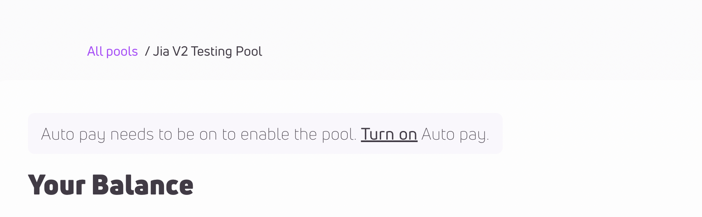
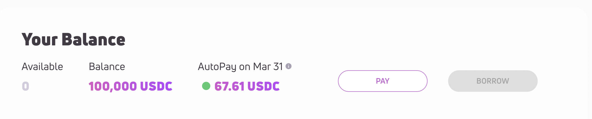
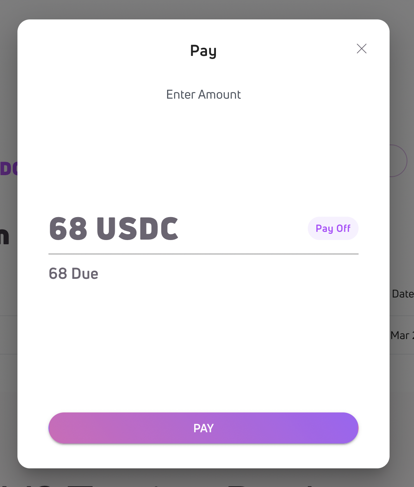
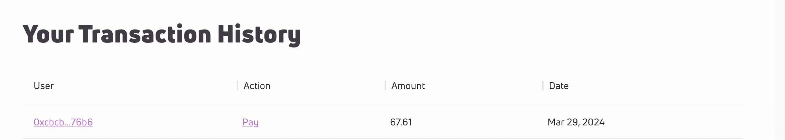

## Loan Management

As a borrower in a pool, the three most important actions you can perform are:

- Obtaining credit approval
- Initiating a drawdown
- Making payments, either by enabling AutoPay or repaying manually

### Getting Approved

**Borrower Approval**

You must obtain credit approval from the Evaluation Agent of the pool before drawing down. The terms of a credit include:

- Credit limit: This is the maximum borrowing amount. The credit limit cannot exceed 4 billion of the underlying asset (stablecoin) of the pool.
- Duration: This is the loan duration, given in payment periods. Duration can be monthly, quarterly, or semi-annually.
- Yield APR: This is the annualized percentage rate of the credit. It determines the yield due for each payment period.
- Late fee APR: This is the pool-level setting that decides the amount of the late fee. If a payment is late, this fee is charged in addition to the regular yield charge. Like yield, it's an annualized rate.
- Minimum principal rate: This pool-level setting determines the amount of principal payment due each payment period. It's a per-payment-period rate. For example, a 10% minimum principal rate means 10% of the principal must be repaid at the end of each payment period.
- Committed loan amount: This is the amount the borrower pledges to borrow. Yield will be charged on this amount if the outstanding principal balance is below it.
- Designated start date: This marks the commencement of the credit term. Borrowing is disallowed before this date and interest starts accumulating from this point forward.
- Revolving: This indicates whether the borrower can reuse the credit after repaying a portion of the principal. For instance, if the approved credit is $1,000, the borrower has taken out $500, and $400 is repaid, the remaining credit will be $500 for non-revolving credit and $900 for revolving credit.

Depending on the pool you are borrowing from, you may also need to sign legal agreements off-chain with the Pool Owner.

**Receivable Approval**

If you're borrowing from a Receivable-backed Credit Line pool that doesn't have receivable auto-approval, you'll need to get your receivables approved by the EA before you can use them for drawdown. However, for pools with receivable auto-approval, receivables will be automatically approved during the drawdown process, hence no manual approval would be required.

### Drawdown

Once your credit request is approved, you can begin the drawdown process, either through the DApp or by interacting directly with the contract to initiate the drawdown. The specific function you call depends on the type of pool you're borrowing from:

- For Revolving Credit Line pools, use the `drawdown()` function in the `CreditLine` contract.
- For Receivable-backed Credit Line pools, use the `drawdownWithReceivable()` function in the `ReceivableBackedCreditLine` contract. Don't forget to provide the receivable NFT token ID for drawdown.
- For Receivable-factoring Credit pools, use the `drawdownWithReceivable()` function in the `ReceivableFactoringCredit` contract. Remember to supply the receivable NFT token ID for drawdown.

For the last two types of pools, you'll give up your ownership of the receivable during drawdown. Ensure that you have authorized the `ReceivableBackedCreditLine` or the `ReceivableFactoringCredit` contract to perform the transfer from you.

You may also use the SDK to draw down. See the [Using the SDK](#using-the-sdk) section for more details.

### Making Payment

At the end of each period, you need to pay the total amount due. This includes any due yield, the principal if the pool requires a minimum principal payment per period, and any late fees if you've missed past payments. You can either enable AutoPay to automatically deduct the full amount due from your wallet, or you can manually pay it back through the DApp, SDK, or by interacting directly with the contract.

**AutoPay**

AutoPay can be enabled in the DApp on the pool details page, and requires signing a one-time transaction. You can enable AutoPay either through the borrower card section, or while drawing down from the pool:

Under the hood, AutoPay works by approving the max allowance of the underlying token to the pool contract. While AutoPay is enabled, the pool will attempt to pull the total amount due from your wallet once a period ends. If the funds are not immediately available in your wallet, AutoPay will monitor and attempt to pay back once they are.

AutoPay will check and attempt to pay every five minutes. If you have the appropriate amount of funds available and AutoPay is not working, please contact us or proceed with Manual Payment below.

**Manual Payment**

You have the option to make manual payments at any point during the period, even if AutoPay is enabled, although no refund for yield due will be given for early payments. If you're using the DApp, follow the steps below:

1. Open up your pool details page and ensure your wallet is connected to the correct chain
2. At the top of the screen navigate to the borrower card section and click on the “Pay” button

1. The default payment amount is whatever total due you have for the period. If you’d like to pay more, you can enter a different number on this input

1. The payment requires your wallet to sign a transaction. The payment should show up in the “Your Transaction History” section

Alternatively, you can call contract functions directly to execute payments. The specific function you need to call will depend on the type of pool from which you're borrowing:

- For Revolving Credit Line pools, use the `makePayment()` function in the `CreditLine` contract.
- For Receivable-backed Credit Line pools, use the `makePaymentWithReceivable()` function in the `ReceivableBackedCreditLine` contract. You'll need to provide the receivable NFT token ID that you previously used for drawdown.
- For Receivable-factoring Credit pools, use the `makePaymentWithReceivable()` function in the `ReceivableFactoringCredit` contract. Again, you'll need to provide the receivable NFT token ID that you previously used for drawdown.

If you specify a payment amount that exceeds the payoff amount on the receivable, the contract will only collect the due amount and the remaining funds will be left untouched. Keep in mind that the pool will maintain ownership of the receivable NFT, even after it's paid off.

You can also utilize the SDK to make repayments. Refer to the [Using the SDK](#using-the-sdk) section for more information.

### Credit Closure

Your credit will automatically be closed once it's paid off and has passed its maturity date. You also have the option to close a credit early, before its maturity date, provided the following conditions are met:

- The outstanding balance on the credit has been paid off. This includes the amount due next, any past due amounts, and the outstanding principal.
- There is no committed amount on a credit that has already started. You can also close a credit that's been approved but not started and has an outstanding commitment.

### Using the SDK

The Huma SDK provides utilities for interacting with protocol contracts, along with various on-chain and off-chain data storage. It enables you to programmatically perform the borrowing-related actions described above.

Download the SDK as an NPM package [here](https://www.npmjs.com/package/@huma-finance/sdk). You can find the SDK's code in [this Github repo](https://github.com/00labs/huma-js/tree/develop/packages/huma-sdk).
