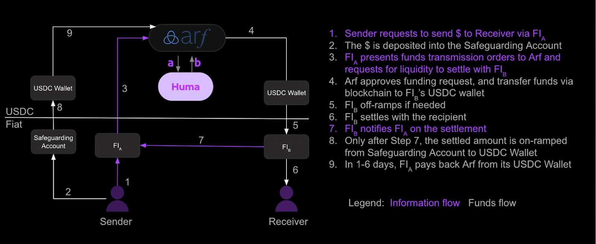

### What is the relationship between Huma and Arf?

Huma merged with Arf, a leading on-demand liquidity provider for global payments, in 2024. This merger significantly enhanced Huma's PayFi network by integrating Arf's real-time liquidity capabilities.
The integration enables the platform to address liquidity challenges in cross-border payments by using blockchain to facilitate near-instant settlement, eliminating the need for pre-funding accounts. This results in quicker cross-border transactions, available in more corridors. It also frees up $4T in traditional pre-funding to be used in more productive ways.
So far, Huma's PayFi network has processed over $2.0 billion in transactions and is expected to surpass $10 billion next year.

### How does Arf work?

Arf uses blockchain and stablecoins to help licensed financial institutions settle cross-border payments faster and cheaper, without pre-funding. Arf only serves licensed financial institutions, with most clients located in developed countries like the US, UK, and France. Institutions are selected based on various factors such as their history and financial standing.

In Arf's process (see diagram above), the remitter deposits funds into a regulated safeguarding account. Institution A submits a settlement request, Arf sends USDC to Institution B, which disburses the funds to the recipient. Institution A is then notified, converts funds to USDC, and returns them to Arf.

Key features:
- Only licensed financial institutions are clients.
- Funds stay in regulated safeguarding accounts. The funds in the account can only be used for the payment settlement.
- Settlements take 1-6 days.

Arf is likely the largest use case for stablecoins outside of trading. For more info, see Circle's case study on USDC: [Circle Case Study - Arf](https://circle.com/en/case-studies/arf).

### Which chains is Huma running on?

Huma is currently live on Polygon, Celo, Stellar, Scroll and Solana.

### Is Huma open-sourced?

Yes, our EVM contracts are [open-sourced](https://github.com/00labs/huma-contracts-v2). We also plan to open-source our Solana and Stellar contracts once they are live.

### What is Huma protocol's long-term vision?

We're committed to transforming the global financing experience through blockchain and stablecoin technologies, particularly by streamlining cross-border payments. Currently, most cross-border transactions take T+3 or T+4 days to settle, but we believe that within the next 10 years, this will shift to T+1 or even T+0. This leap in efficiency will redefine global commerce, enabling faster, more efficient transactions that reshape the financial landscape, solving problems for businesses and people all around the world.

### Can I use Huma LP tokens in other DeFi protocols?

Currently, Huma LP tokens can't be used in other DeFi protocols. However, integrating them with other protocols is on our roadmap for 2025!
