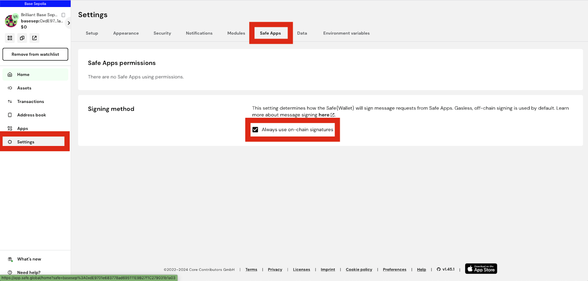

## Why Join the Arf Pool?

### What real-world problems does Arf solve?

Arf addresses the inefficiencies of traditional cross-border payments, where transactions through SWIFT and intermediary banks typically take T+3 or T+4 days, if not longer. To speed up transfers, financial institutions often prefund 20% to 25% of their monthly transaction volume, leading to $4 trillion being tied up in prefunding accounts globally. This creates a significant financial burden and limits the ability of institutions to scale quickly.

For example, if a financial institution has a successful US-to-Brazil business and wants to expand to Argentina, it must first secure enough Argentine pesos to prefund its counterparty in Argentina. This process can delay expansion and strain resources.

Arf eliminates this burden by using blockchain and stablecoin technologies, freeing financial institutions from pre-funding requirements and unlocking more working capital for business growth.

### What is Arf's value proposition to its customers?

Arf's value proposition lies in transforming the operations of licensed financial institutions by eliminating the need for pre-funding, which is traditionally capital-intensive. By leveraging blockchain and stablecoin technologies, Arf enables these institutions to operate in a more capital-efficient manner, freeing up significant working capital. This allows them to scale and seize growth opportunities much faster than before.

### Why should I participate in Arf pools?

Participating in Arf pools offers double-digit stablecoins yield with relatively low risk. In some cases, partners also provide additional incentives to liquidity providers (LPs), For example, Scroll offers token incentives to Huma LPs.

Additionally, by joining Arf pools, you'll earn Huma points for your early contribution to Huma's mission to transform global payment financing.

### Where does the yield come from? How stable is the yield?

Arf's yield is generated from real-world transactions, not from token emissions like many DeFi protocols. The yield comes from providing high-value services to licensed financial institutions in the cross-border payment sector, where the willingness to pay is significant due to the immense benefits Arf offers. As one of the few projects delivering double-digit yields from real-world use cases, and given the strong demand for Arf's services, we expect the yield to remain stable and strong.

### How is the Arf product related to receivable financing?

Arf's business focuses on payment settlement financing, which is a specific type of receivable financing but with a key distinction. In Arf's case, the financing is backed by 100% cash held in safeguarding accounts, whereas traditional receivable financing typically involves non-cash collateral such as goods or factories. The significant difference between cash and goods as collateral means Arf carries much lower risk.

### How does Arf make the principals safe?

Arf Pools are backed by bonds issued by Arf Capital Ltd. and is structured in three layers.

- Senior : The senior tranche is generally seen as a lower-risk investment. It offers a lower yield compared to junior but carries less risk. If there's a default, senior tranche lenders receive payment first.
- Junior : The junior tranche, on the other hand, assumes a higher risk and earns a higher yield when things go smoothly. If there's a default, junior tranche lenders are paid after those in the senior tranche. Arf pools typically have a min 10% junior requirement, to protect senior investors.
- First-loss Cover : Typically 2% of the pool and is provided by Arf Capital itself to protect junior and senior investors against small defaults.

Arf manages default risk in multiple ways :

- Arf only serves licensed financial institutions, primarily in developed countries, which reduces exposure to risk.
- All funds financed by Arf are pre-paid by the sender and securely held in a safeguarding account. The funds are used for settlement only, ensuring funds are available to complete transactions.
- The entire settlement process takes just 1-6 days, and we expect this duration to further shorten over time, minimizing exposure.

Per S&P's stats, bad debt in financial institutions over the last 20 years was 0.25%, with most occurring in developing countries.

Arf has processed over $2 billion in USDC on-chain transactions to date, with zero credit defaults.

### What are Senior and Junior tranches in the Arf liquidity pools?

In finance, the term "tranche" refers to portions or segments of pooled financial products, such as loans, mortgages, or liquidity pools like those in Arf. Senior and Junior tranches offer different levels of risk and return, with Senior tranches being lower risk with lower and fixed yields, while Junior tranches are higher risk with higher and variable yields.

Arf's Senior Tranche:
- Offers lower, fixed yields.
- When a loss occurs, impacted only if losses exceed both the first-loss cover and the Junior tranche.
- The Junior tranche must always be at least 10% of the pool, enforced by smart contracts.

Arf's Junior Tranche:
- Carries higher risk but offers a higher, floating yield.
- When a loss occurs, first-loss cover absorbs initial losses; beyond this, the Junior tranche bears the losses.

**Yield calculation**: The Junior tranche yield is floating, which means it depends on the Senior-to-Junior ratio in the pool. For example, if Arf borrows from the pool at 12%, and the Senior tranche yield is fixed at 11%:
- With a 90% Senior / 10% Junior ratio, Junior yield is 21% (12% + (12% - 11%) * (90% / 10%)).
- With an 80% Senior / 20% Junior ratio, Junior yield is 16% (12% + (12% - 11%) * (80% / 20%)).

The yield for junior tranche in a Huma pool proceeds with an "up to" label. The yield is calculated by keeping senior-to-junior ratio at the maximum allowed value. As more deposits go to the junior tranche, it can no longer maintain the maximum senior-to-junior ratio even if the remaining room in the pool is filled with senior tranche. When this happens, the "up to" yield for a junior tranche will reduce.

### How does First-loss Cover work? How does it protect the investors?

First-loss Cover acts as a protective buffer by absorbing initial losses in the event of a default.

- If a loss occurs, the First-loss Cover is used first, shielding both Junior and Senior tranche investors.
- After the First-loss Cover is exhausted, Junior tranche investors bear any remaining losses, with Senior tranche investors affected only if both the First-loss Cover and Junior tranche are depleted.

This structure provides extra protection to Senior tranche investors, making their investment safer, while Junior tranche investors take on more risk in exchange for higher returns.

## How Do I Participate in an Arf Pool?

### Who can invest in Arf?

Arf requires professional/accredited investors. To qualify, investors must confirm that they meet at least two of the following three conditions:

1. You have carried out transactions, in significant size, on the relevant market at an average frequency of 10 per quarter over the previous four quarters.
2. Your financial instrument portfolio, defined as including cash deposits and financial instruments exceeds EUR 500,000.
3. You worked in the financial sector for at least one year in a professional position requiring knowledge of the transactions or services envisaged.

Only after declaring their professional investor status can potential investors access more detailed information about Arf’s investment opportunities.
Additionally, potential investors must complete KYC or KYB processes. Only those residing outside restricted countries or regions are permitted to participate in the Arf pool. You can find the restricted country/region list [here](https://campaigns.app.huma.finance/#/restricted-countries?poolName=ArfCreditPool6Months&chainId=534352).
Innovative securities are subject to significant risks, including loss of principal. Any investment decision should only be made after reading the Private Placement Memorandum (the "PPM") associated with the products, as well as the associated subscription documents. The PPM and such associated documents will be made available to qualified investors only. In particular, any investment decision should be based on an assessment of the Risk Factors set forth in the PPM.

### How to do KYC/KYB?

Arf uses Persona to handle KYC/KYB processes. Most KYC checks are completed in 2-3 minutes without human intervention from Arf's compliance team. However, all KYB applications require manual review, which can take a few days depending on the completeness of the submitted documents. Please allow time for this turnaround.

You don’t need to wait for a campaign to launch to begin the KYC/KYB process. You can start by clicking any existing campaign (e.g., the Scroll campaign) to complete KYC/KYB. Completing this process doesn’t commit you to an investment, but it ensures you can deposit immediately when a new pool opens, giving you maximum opportunity to participate in the campaign.

### What is the required minimum investment amount?

The required minimum investment amount for Arf pools is **1,000 USDC**.

### Is there a limit on how much I can invest?

There is no individual investment limit, but each pool has an overall cap. You can only invest if there is still room available in the pool.

In some cases, the pool might have an investment cap, after which Huma Points won’t accumulate. Those cases will be clearly stated on the pool page.

### Why are there lockup periods?

Lockup periods are necessary because the real-world businesses Arf operates with—cross-border payment financial institutions—require predictability to operate smoothly.

Although these institutions typically return funds to Arf within a few days, agreements are in place to ensure funds remain available for a certain period, preventing sudden interruptions to their operations. In return, the institutions commit to using a specific amount of funds, which helps guarantee the listed yield for investors. This structure provides stability for both the businesses and the investors, ensuring predictable returns from real-world operations.

### When will the interest be paid?

The interest for the campaigns is typically auto-reinvested in the pool. It will be paid out when you withdraw your funds from the pool, after your investment reaches maturity.

On EVM, depending on the pool configuration, investors can receive interest payments on a regular basis, either monthly or quarterly. This capability is not available on Solana or Stellar at the initial launch. It will be added later.

### What happens when a pool matures?

Currently, all assets in Arf pools are set up as bonds. Once a bond matures, you will need to withdraw both the principal and interest. It's highly likely that Arf will have new pools for you to invest in. You can deposit into any of the open pools immediately.

### How does the referral work?

When you refer friends to join Huma, you can be rewarded with 10% of the points your friends earn when they deposit into pools. You will also earn 5% of the points earned by every person your friends refer to Huma.

We are also preparing to launch products that will allow you and your friends to team up and complete quests to earn even bigger rewards. Stay tuned for the launch!

### Why does it not work when I sign in using a Safe wallet?

Please make sure you are using "on-chain signatures" as the signing method. You can change the settings in "Settings" -> "Safe Apps" -> "Signing Method" -> "Always use on-chain signatures", as shown in the image below:

### Do I need to KYC/KYB again on Solana if I have done it on EVM?

No, you don’t have to. First, you need to connect to the EVM wallet that you used for KYC/KYB via one of the Scroll pool pages. After that, you can return to the Solana pool and connect to your Solana wallet to bypass KYC/KYB.

### What wallets are supported?

We support Metamask, Phantom, Solflare, Coinbase, Ledger, Trezor, Backpack and WalletConnect for our Solana Campaign.
