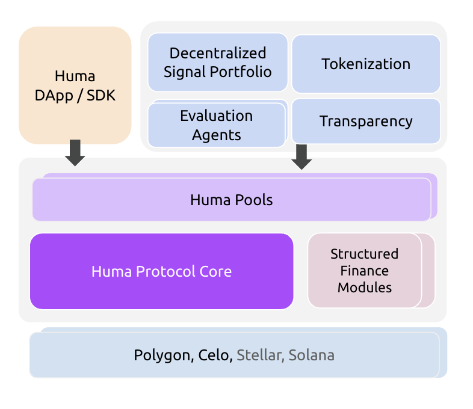

## Protocol Overview

Huma V2 has been launched on several EVM chains (Celo and Polygon). It will expand into Stellar and Solana later this year. Figure 1 shows a high-level overview of the protocol.

- **Huma Pools:** The protocol includes a set of smart contracts that are designed to adapt by supporting different implementations of tranche policies, fee managers, and due managers. It also allows for customization to accommodate key use cases, such as credit line (credit facility), receivable-backed credit line, and receivable factoring.
- **Evaluation Agents:** Evaluation Agents are tasked with making underwriting decisions for borrowers, recording these decisions in the pool contracts, and performing various administrative actions on approved credits.
- **Tokenization:** This module enables borrowers to display the performance of their receivables on-chain, offering greater transparency to lenders. In the case of receivable-backed credit lines and receivable factoring, Evaluation Agents will also review the tokenized receivables to make underwriting decisions. These receivables can be represented in an NFT (Non-Fungible Token) format.
- **Huma DApp/SDK:** This interface allows different pool participants to interact with the Huma protocol, such as borrowers drawing down and making payments, and lenders making deposits and withdrawals. We anticipate that most business users will utilize the SDK.
