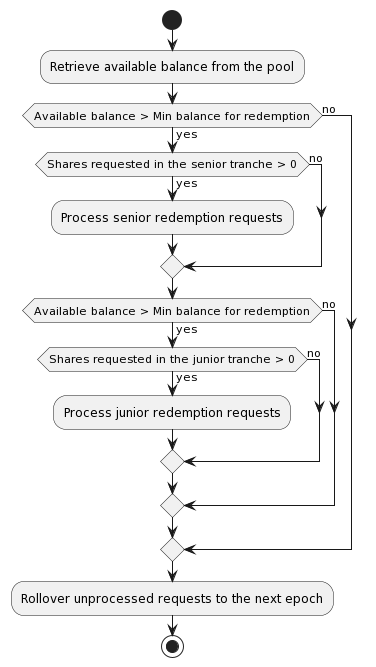

## Epoch and Redemption

With both senior and junior tranches, we must protect seniors’ interests. We can't simply process redemption requests in the order they're submitted, as was done in V1. Instead, we'll batch these requests and process them at the end of an epoch, prioritizing senior redemptions. The epoch window will align with the pool’s payment period.

### Redemption Requests and Cancellation

All lenders can submit redemption requests at no cost, but only those meeting the lockout period requirements will be accepted. Redemption requests can be canceled at no cost before the epoch starts to process them.

### Epoch Processing Logic

All accepted redemption requests within this epoch, plus requests rolled over from the previous epoch, determine which requests will be honored.

Senior tranche requests are evaluated first, as senior redemption cannot breach the max senior-junior-ratio constraint. If there's enough liquidity, all senior redemptions can be accepted. If not, redemption requests will be handled pro rata, with the unfulfilled portion rolled over to the next epoch.

If capital remains in the pool, junior redemption requests will be evaluated next. We ensure the max senior-junior-ratio is honored, meaning only the portion of redemption that is within the max threshold will be accepted. If there's insufficient liquidity to cover all junior redemption requests, they'll be handled on a pro-rata basis, with the unfulfilled portion rolled over to the next epoch.

Two things to note:

1. The protocol sets a minimum threshold to prevent the need to split infinitesimal amounts among lenders. Consequently, redemption requests will only be processed if the pool's available balance exceeds this threshold.
2. The ratio at which redemption requests are honored is based on your requested shares, not the total shares you own. Although the latter is less susceptible to gaming, implementing it involves complexities. For efficiency considerations, redemption request processing is based on the total number of shares requested rather than scanning through individual lender's requests. However, to honor approved shares based on ownership, we would have to enumerate each lender's requests. For example, if lenders L1 and L2 each have 1000 shares, L1 requested 100 shares to redeem, L2 requested 200, and the epoch has 250 shares to distribute, there is no easy way to achieve the ideal distribution (100 shares to L1, 150 shares to L2) without iterating through each lender’s ownership. Therefore, we decided to honor redemption requests based on the number of requested shares.

The diagram below illustrates the epoch processing logic.

### Redeemed Fund Withdrawal

Once the redemption requests are fulfilled, the redeemed amount will be made available in the `TrancheVault` contract for withdrawal. You can then withdraw your funds through the DApp. If you are familiar with smart contracts, you can also call the `disburse()` function on the `TrancheVault` contract to withdraw your funds.
