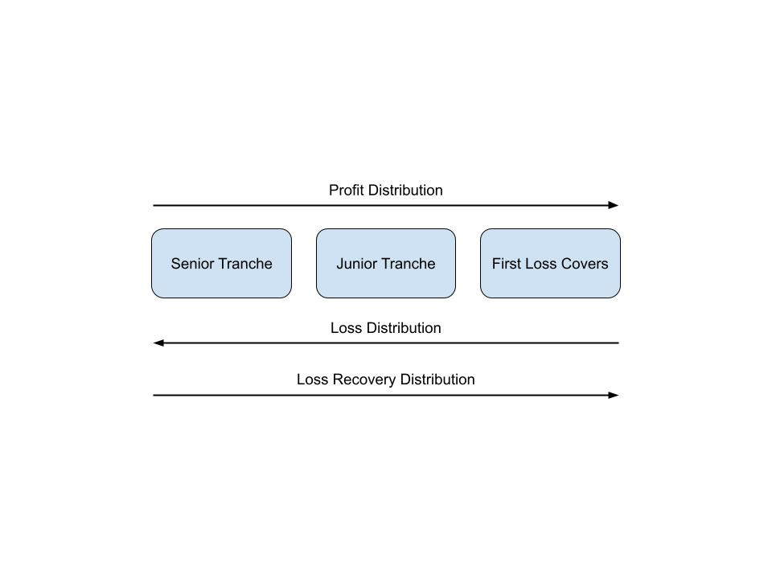

## First Loss Covers

While most pools on Huma will be backed by income or receivables, first loss covers will be used to partially or fully cover any losses from defaults when receivables are unenforceable. Such losses are covered before they are passed onto the lenders.

Each pool can have up to 16 different forms of first-loss cover in V2. The initial three types to be included are:

- Extra collateral from the borrower.
- Insurance - This option is listed for future consideration as the market is not yet prepared for comprehensive liquidity insurance.
- A reserve fund provided by the Pool Owner and the Evaluation Agent.

Participants who contribute capital to first loss covers are known as "First Loss Cover Providers."

### Deposit and Withdrawal

Before a pool can be enabled, First Loss Cover Providers must deposit a sufficient amount into their layer of the first loss cover. The sufficiency level is determined by the `minLiquidity` parameter in `PoolConfig`.

Withdrawals are regulated by the `readyForFirstLossCoverWithdrawal` flag. Unless this flag is set to `true`, no withdrawals are allowed. Typically, this flag is only set to true after the pool has been closed.

### Covering Loss

In the event of a default, the amount of loss covered by the first loss covers is calculated as the lesser of the `firstLossCoverCap` and the product of `firstLossCoverRate` and the `defaultAmount`, i.e. `min(defaultAmount * firstLossCoverRate, firstLossCoverCap)`. The order of loss coverage is the same as the order of the first loss covers listed above. That is, the borrower's extra collateral will be used first, followed by insurance, and finally, the reserve fund provided by the Pool Owner and EA.

### Loss Recovery

If a loss is initially declared and later fully or partially recovered, the recovered funds are distributed back to those who experienced losses. Distribution follows this order: the senior tranche first, then the junior tranche, and finally, the first loss covers. Note that the order of recovery is the opposite of the loss coverage order mentioned above.

### Coverage Growth

Since the first loss cover capital is not deployed, it is unproductive. Typical coverage ranges from 2% to 10% and rarely exceeds this rate. We recognize that there are likely fewer defaults early in a pool's cycle, so there's no need for excessive coverage initially. Accordingly, we have a mechanism to grow first loss coverage over time.

A pool cannot be enabled until the minimum coverage for all first loss covers is met. Afterward, the Huma protocol requires the yield produced by the first loss covers to be reinvested into the cover. Also, until the coverage reaches its maximum, all fees generated for the admins (Huma Protocol, Pool Owner, EA) are automatically deposited into the first loss cover. This strategy aligns the admins' interests with the success of the pool.

Below is a diagram showing the order of PnL distribution:

