## Step-by-step Guides

### Onboarding

1. To onboard as a lender, click on the “SUPPLY USDC” button at the bottom of the “Pool Overview” section.
   
   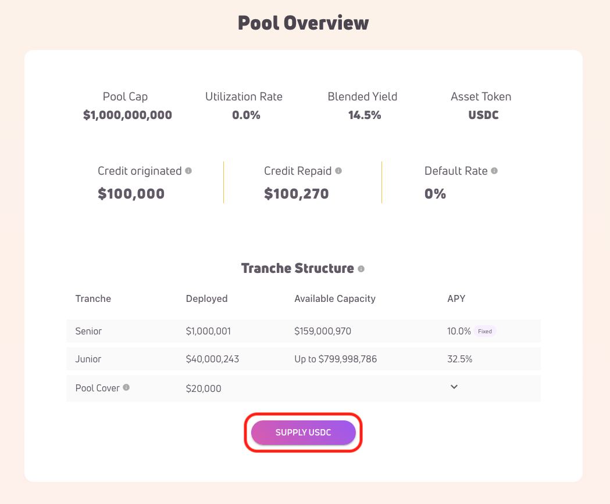

2. You will be prompted by your wallet to sign a message to verify that you are the wallet's owner. If you are using MetaMask, click on “Sign-In”.
   
   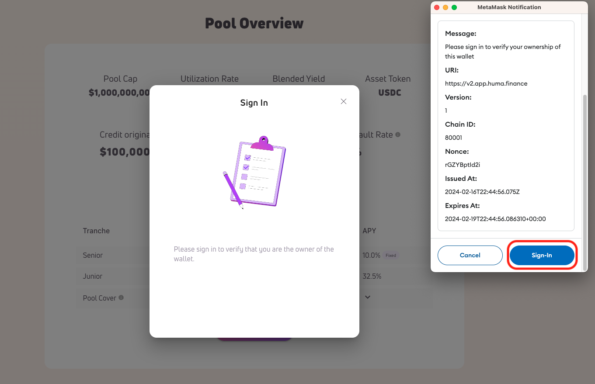

3. Complete the KYC/KYB flow. Here are a few possible scenarios:
    1. If you don’t have a Securitize account, click on “Create a SecuritizeiD” to create one.
    2. If you already have an account but haven’t logged in yet, please log in.
    3. If you have already logged in, you will see the authorization screen directly.
4. On the authorization screen, click on “Allow”. You will be redirected back to the lending page.
   
   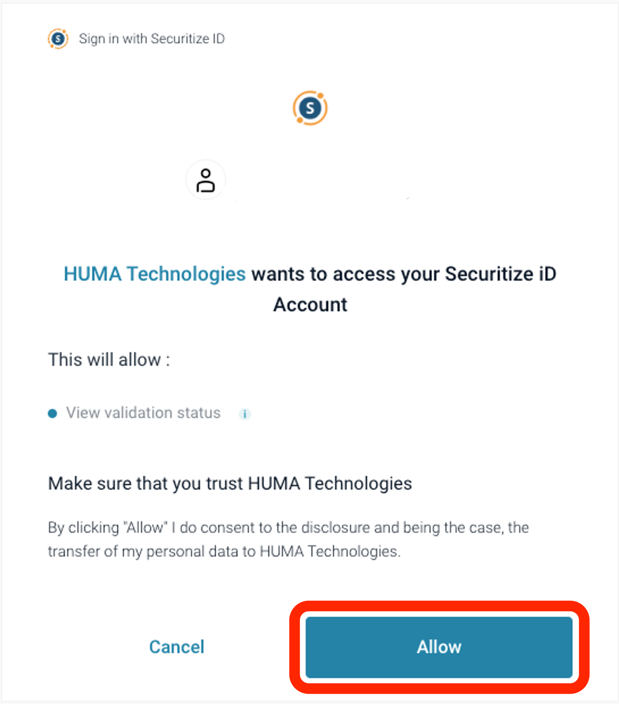

5. Click on “SUPPLY USDC” again, then “GET APPROVED”. You will be redirected to the Securitize website.
6. Click on “Verify Your Identity” to complete the KYC process.
7. Once your KYC/KYB request is approved, you may need to go through the accreditation/qualification process, depending on your country/region of residence.
8. Review and sign legal documents if the pool requires it.
9. The Pool Owner will contact you after they have reviewed the signed documents and added you as a lender.

### Supplying Liquidity

1. Click on the “SUPPLY” button in the “Your Investment” section or the “SUPPLY USDC” button in the “Pool Overview” section.
2. Select the tranche you want to invest in and click on “NEXT”. Note that you can only invest in the tranche for which you are an approved lender.
   
   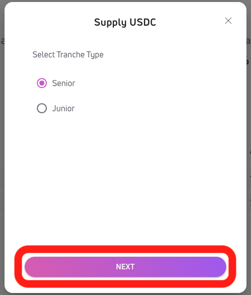

3. Input the amount you want to invest and click on “SUPPLY”. Your wallet will prompt you to sign the transactions.
   
   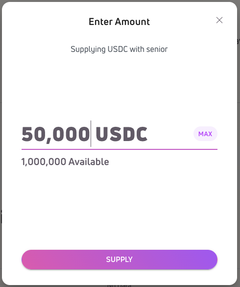

4. If your transaction is successful, you will see the following screen.
   
   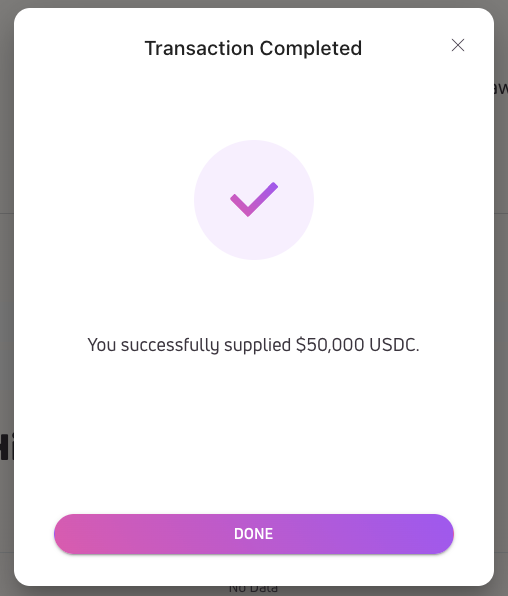

### Requesting Redemption

1. Click on the “REDEEM” button in the “Your Investment” section.
2. If the pool is a multi-tranche pool, and you have invested in more than one tranche, elect the tranche from which you want to request redemption.

   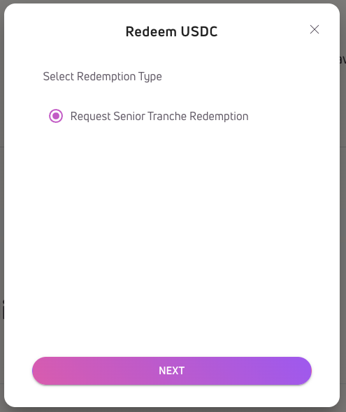

3. Enter the number of shares you would like to redeem. You will see the corresponding amount of assets you will be redeeming below the input.

   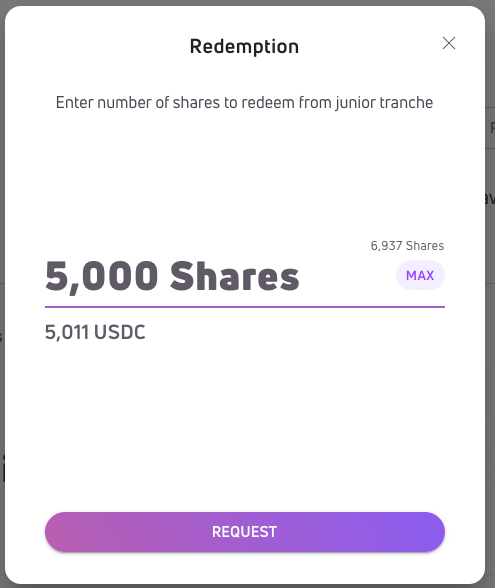

4. If your request is successfully submitted, you will see the following screen.

   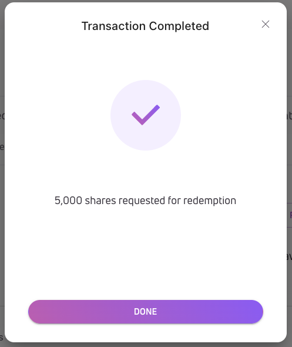

   You will also see your redemption request in the “Your Redemption” section.

   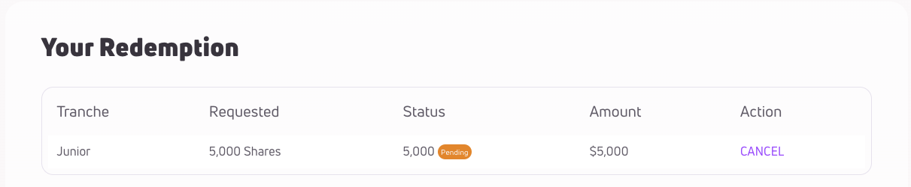

### Canceling Redemption Requests

1. Click on the “CANCEL” button next to your pending redemption request. Note that fulfilled redemption requests cannot be canceled.

   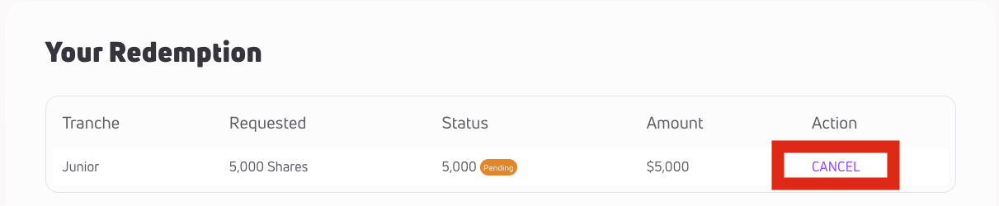

2. You should see the following screen if your redemption request is canceled successfully.

   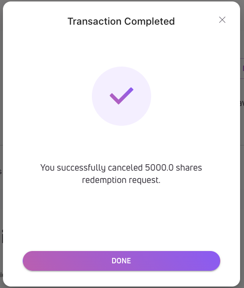

[comment]: # TODO add "### Withdrawing Funds Redeemed" and "### Withdrawing After Pool Closure"
