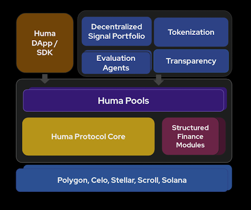

## Core Protocol Features

Similar to other RWA/PayFi protocols, Huma allows LPs to deposit and withdraw funds, while borrowers can access credit and repay loans. However, Huma stands out with several unique features that set it apart, making it expertly tailored for real-world financial use cases:

- **Tailored for payment financing:** Huma is optimized for on-chain credit facilities, particularly for payment financing use cases. It uniquely supports credit lines and receivable-backed credit lines, addressing specific needs in this space.
- **Modular structured finance:** Unlike other protocols, Huma has taken a modular approach to structured finance. This allows flexibility in adapting to various financial structures—different calendars, fee structures, and tranche structures—making it highly customizable for diverse use cases.
- **Advanced risk management:** Risk management is the core foundation for any PayFi or RWA protocol and is central to Huma. Huma has built-in infrastructure for dynamic risk assessment, leveraging DSP and external adapters (EA) that pave the way for AI-driven financing and underwriting.
